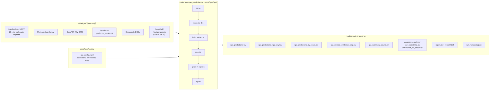
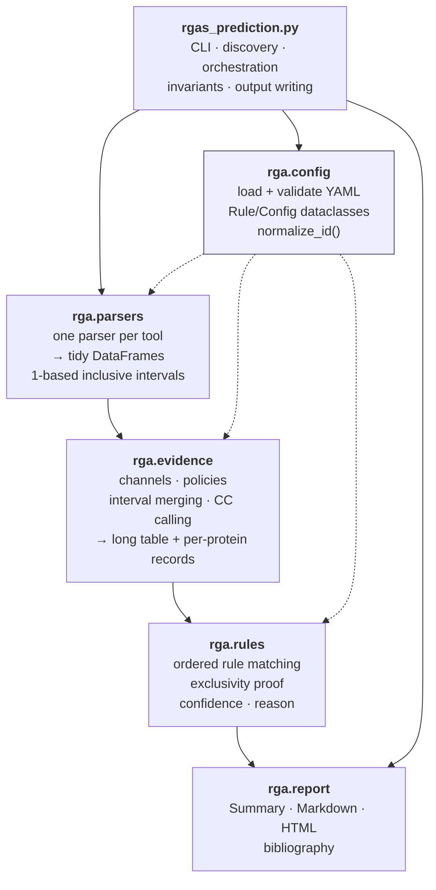
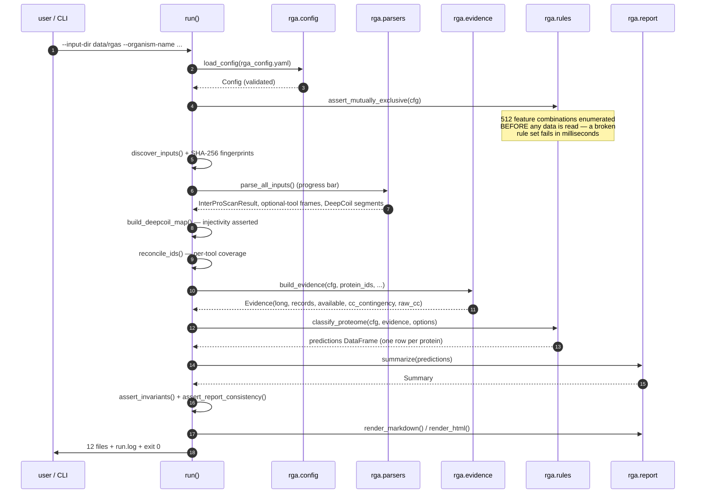
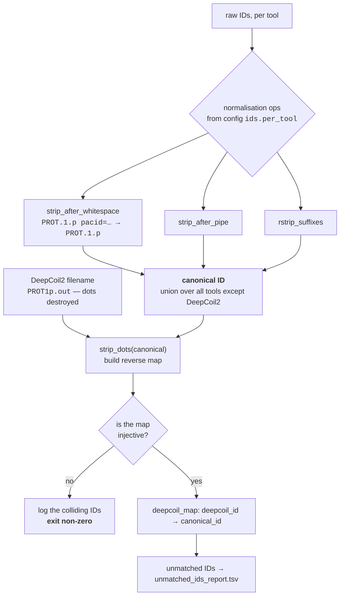
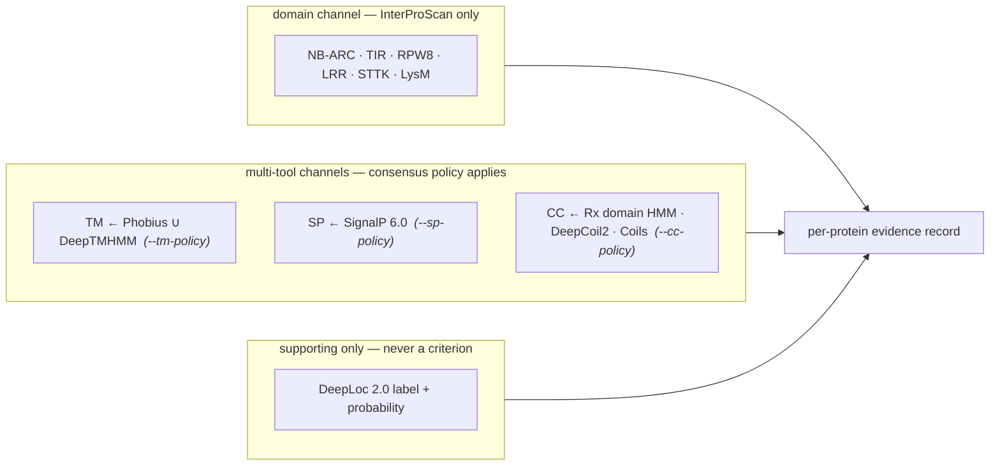
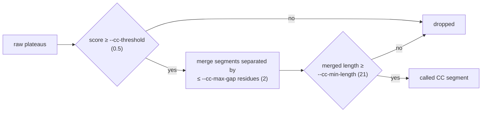
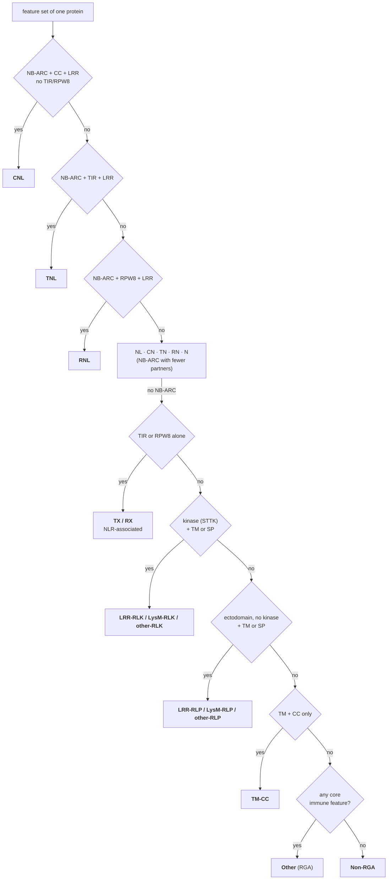

# RGA pipeline — architecture, design decisions and rationale

Companion to [`README.md`](README.md) (how to *use* the pipeline) and
[`REVIEW_NOTES.md`](REVIEW_NOTES.md) (what the second-pass review found).
This document explains **what the pipeline is made of, why it is built that way, and
how each part works**.

Everything below describes code in this repository at version **0.0.1**
(`code/rgas/rgas_prediction.py`, package `code/rgas/rga/`, configuration
`code/rgas/config/rga_config.yaml` v0.0.1). Numbers quoted as "reference run" come from the
*Saccharum officinarum × spontaneum* R570 proteome shipped in `data/rgas/`
(299,731 proteins) and are reproduced in `results/rgas/SaccharumR570/run_metadata.json`.

**Contents**

1. [Design principles](#1-design-principles)
2. [System context](#2-system-context)
3. [Module map](#3-module-map)
4. [Execution sequence](#4-execution-sequence)
5. [Stage 1 — discovery and fingerprinting](#5-stage-1--discovery-and-fingerprinting)
6. [Stage 2 — parsing](#6-stage-2--parsing)
7. [Stage 3 — identifier reconciliation](#7-stage-3--identifier-reconciliation)
8. [Stage 4 — the evidence layer](#8-stage-4--the-evidence-layer)
9. [Stage 5 — the rule engine](#9-stage-5--the-rule-engine)
10. [Stage 6 — confidence and reason](#10-stage-6--confidence-and-reason)
11. [Stage 7 — outputs and invariants](#11-stage-7--outputs-and-invariants)
12. [Decision log](#12-decision-log)
13. [Failure modes and graceful degradation](#13-failure-modes-and-graceful-degradation)
14. [Performance and memory](#14-performance-and-memory)
15. [Extension points](#15-extension-points)

---

## 1. Design principles

Five principles drove every structural decision. Each is *enforced somewhere*, not
merely aspirational — the "enforced by" column is the point of the table.

| # | Principle | Why | Enforced by |
|---|-----------|-----|-------------|
| P1 | **No biological constant in Python.** Every accession, threshold, rule and label lives in `rga_config.yaml`. | Adapting to another species must be a config edit, never a code edit; and a reviewer can audit the biology without reading Python. | `load_config()` validation; `_build_rules()` rejects rules referencing unknown features; the whole resolved config is copied into `run_metadata.json`. |
| P2 | **Match by accession, never by description string.** | Signature descriptions are free text, change between InterPro releases, and match by accident (`"LRR"` matches "Leucine-rich repeat" *and* "LRR-containing protein kinase-like"). Accessions are stable identifiers. | `Config.accession_to_features()`; the legacy regex path was deleted. `accession_audit.tsv` reports the hit count of every configured accession so a dead accession is visible. |
| P3 | **Never silently drop a protein.** | A genome survey whose denominator is unknown is uninterpretable. | `assert_invariants()`: output row count == input protein count, no duplicates, set equality, every row carries a `rule_id`. Non-RGAs are classified, not filtered. |
| P4 | **Classes are provably mutually exclusive.** | The legacy `if/elif` chain leaked proteins between classes silently (see REVIEW_NOTES §2). "It looks disjoint" is not a guarantee. | `assert_mutually_exclusive()` enumerates all 2⁹ = 512 feature combinations at start-up and fails the run if any combination matches two non-fallback rules. Also a hard pytest. |
| P5 | **Every number is computed once.** | Two independent computations of "how many CNLs" will eventually disagree, and the report is what people read. | A single `Summary` object feeds `report.md`, `report.html`, `rga_summary_counts.tsv` and `run_metadata.json`; `assert_report_consistency()` cross-checks them before writing. |

---

## 2. System context



Three properties of this picture matter:

- **`data/` is read-only.** The pipeline opens input files for reading and never writes
  inside `data/`. The one derived artefact it caches (the DeepCoil2 segment table) goes to
  `<outdir>/cache/`.
- **No network at runtime.** Every annotation is pre-computed. This is what makes a run
  reproducible years later, and why the bibliography is checked offline in code review
  rather than resolved at run time.
- **One organism per output directory**, named from `--organism-name`, so several genomes
  can be surveyed side by side with the same configuration.

---

## 3. Module map



Solid arrows are data flow; dotted arrows are "reads configuration from".

| Module | Lines | Responsibility | Deliberately *not* its job |
|--------|-------|----------------|----------------------------|
| `rgas_prediction.py` | 1,355 | Argument parsing, input discovery, file fingerprints, ID reconciliation, orchestration, invariants, writing all 12 outputs | Any biological decision |
| `rga/config.py` | 405 | Read/validate YAML; expand the `ECTODOMAIN_FEATURES` token; ID normalisation primitives | Knowing what a domain *means* |
| `rga/parsers.py` | 862 | Turn six heterogeneous formats into tidy frames with one coordinate convention | Interpreting features, applying thresholds |
| `rga/evidence.py` | 1,018 | Feature calling, consensus policies, interval merging, LRR copy number, CC segment calling, the long evidence table | Assigning classes |
| `rga/rules.py` | 804 | Ordered matching, exclusivity proof, architecture string, confidence grading, reason generation | Reading files, writing files |
| `rga/report.py` | 651 | The one `Summary`; Markdown/HTML rendering; bibliography | Recomputing any count |
| `rga/progress.py` | 51 | The `ProgressCallback` protocol and its no-op default | Knowing that `rich` exists |

### 3.1 Progress reporting across the layer boundary

Long stages must be able to say how far along they are without importing `rich` —
`parsers`, `evidence` and `rules` have to stay usable from a notebook, a test or another
program with no console attached. The boundary is a one-line protocol in
`rga/progress.py`:

```python
on_progress(0, total=len(sources))   # I now know how much work there is
on_progress(n)                       # I have just completed n units
```

The default is `null_progress`, which does nothing, so the hot loops carry no
`if callback is not None` guard. The CLI is the only place that binds the callback to a
real bar, through one context manager:

```python
with tracked("classifying proteins", total=len(protein_ids)) as report:
    predictions = rules.classify_proteome(cfg, ev, options, on_progress=report)
```

Every stage that can take minutes is covered, and each is measured in units the user can
actually interpret:

| Stage | Bar measures | Total known from |
|-------|--------------|------------------|
| InterProScan | **bytes of the TSV consumed** | `stat().st_size`, via a counting wrapper around the file handle — the chunk iterator itself knows nothing about file size |
| Phobius / DeepTMHMM / SignalP / DeepLoc | tools finished | the fixed `OPTIONAL_TOOLS` list; a tool that was not supplied still advances the bar, so it reaches 100 % on a partial input set |
| DeepCoil2 | directories and archives finished | `iter_deepcoil_sources()`; parallel workers advance it as each future lands |
| Evidence build | proteins | `len(protein_ids)`, reported every 2,000 |
| Classification | proteins | `len(evidence.records)`, reported every 2,000 |
| Writing outputs | files written | the 12-file output list |

Progress bars are `transient=True`, so they leave no residue in the scrollback, and the
`Progress` shares one `Console` with the log handler — which is what lets a log line print
*above* a live bar instead of scribbling through it.

The layering rule is one-directional: **parsers know nothing about features, evidence
knows nothing about classes, rules know nothing about files.** That is what makes each
layer testable in isolation, and it is why the test suite can build a nine-protein
synthetic proteome that exercises every rule without touching the real data.

---

## 4. Execution sequence



Two ordering choices are deliberate:

- **The rule set is proved consistent before the first byte of data is read** (step 3).
  A configuration error costs a millisecond, not the minute it takes to parse an
  InterProScan TSV of this size.
- **Invariants are asserted before anything is written** (step 14). The pipeline either
  writes a complete, self-consistent result set or writes nothing at all.

---

## 5. Stage 1 — discovery and fingerprinting

`discover_inputs()` resolves each tool's path with a strict precedence:

```
explicit CLI flag  >  glob under --input-dir (patterns from config)  >  None
```

Only `interproscan` is mandatory; anything else resolving to `None` disables its channel
and is logged as a `WARNING` (see §13). Globs live in `input_discovery` in the YAML, so a
differently-named directory layout is a config change.

`file_fingerprint()` records, for every input actually used: absolute path, byte size,
line count and **SHA-256**. These go into `run_metadata.json`. The purpose is narrow and
worth stating: it lets a future reader prove that a stated result came from a specific
byte-for-byte input, without needing the 40 GB of raw annotation.

---

## 6. Stage 2 — parsing

One parser per tool, each returning a tidy `DataFrame`. All of them are hardened against
the specific way their format bites.

| Tool | Format hazard | How the parser handles it |
|------|---------------|---------------------------|
| InterProScan 5 | 15 columns, **no header**, free-text description column containing tabs' evil twins (quotes, `#`), tens of millions of rows | `dtype=str`, `na_filter=False`, `quoting=csv.QUOTE_NONE`, read in chunks with an `_IPSState` accumulator so peak memory is bounded by the chunk, not the file |
| Phobius (short) | The `PREDICTION` string mixes the signal-peptide block (`n8-18c23/24`) with TM helices (`45-67`) using the same `-` separator | The SP block is stripped *before* helices are read; otherwise every signal peptide is mis-parsed as a transmembrane helix |
| DeepTMHMM | GFF3 in per-protein blocks; the last block has no trailing separator | Parsing is driven by data lines, not by block separators, so the final protein is never lost |
| SignalP 6.0 | `CS pos: 30-31. Pr: 0.87` — the cleavage site is written as a *boundary*, not a range | Converted to residues `1..30`; the probability is parsed separately |
| DeepLoc 2.0 | Multi-label CSV: several localisations per protein plus per-class probabilities | Kept multi-label; used only as supporting evidence (never a classification criterion) |
| DeepCoil2 | One `.out` per protein, ~300 k files, delivered as directories *and* `.tar.xz` archives; the `cc` column is a per-**segment plateau**, not a per-residue score | `.tar.xz` is streamed with `tarfile` (never extracted to disk) across a `ProcessPoolExecutor`; a segment is a maximal run of residues sharing the same non-zero `cc` value, so two adjacent plateaus with different scores stay separate |

**Coordinate convention.** Every interval leaving this module is **1-based and
inclusive**, matching all six tools. The convention is documented in the module docstring
of `parsers.py` and is the reason `_overlap()` is `min(ends) - max(starts) + 1` — the
`+ 1` is correct exactly once, here, and is unit-tested.

**Why DeepCoil2 gets a cache.** Parsing ~300 k `.out` files dominates wall time. The
pipeline writes the **unfiltered** `(protein, start, end, cc)` table to
`<outdir>/cache/deepcoil_raw_segments.tsv`. Because the cache is unfiltered, re-running
with a different `--cc-threshold`, `--cc-min-length` or `--cc-max-gap` costs seconds, and
the sensitivity analysis in `cc_segment_sensitivity.tsv` is free. `--refresh-deepcoil-cache`
forces a re-parse.

---

## 7. Stage 3 — identifier reconciliation

This is the least glamorous stage and the one most likely to silently corrupt a genome
survey, because each tool mangles protein IDs differently.



**The DeepCoil2 problem.** DeepCoil2 writes one output file per protein and strips `.`
from the filename, so `SoffiXsponR570.7os1g055400.1.p` arrives as
`SoffiXsponR5707os1g0554001p`. The inverse is not computable in general. The pipeline
therefore builds the map in the *forward* direction — apply `strip_dots` to each canonical
ID and index by the result — and then **asserts that the map is injective**. If two
canonical IDs collapse to the same dot-free string, the mapping is ambiguous and the run
aborts with the offending IDs printed, rather than assigning coiled coils to the wrong
protein. In the reference run all 299,731 proteins mapped, 0 unmatched, no collisions.

**Coverage, not silence.** `reconcile_ids()` produces, for every tool, how many IDs it
contributed, how many joined the canonical set, and which did not. That is
`unmatched_ids_report.tsv` (15,524 rows in the reference run — overwhelmingly IDs present
in one tool's output but absent from the InterProScan-derived proteome). Nothing is
dropped quietly; it is dropped *and listed*.

---

## 8. Stage 4 — the evidence layer

### 8.1 Channels

Nine controlled-vocabulary features are produced by three kinds of channel:



The controlled vocabulary is exactly:
`NB-ARC`, `TIR`, `RPW8`, `CC`, `LRR`, `STTK`, `LysM`, `TM`, `SP`
— nine features, hence the 2⁹ exhaustive proof in §9.

**The CC channel is three channels.** Eight of the nine features come from curated domain
models; earlier revisions took the ninth only from propensity predictors, which is what made
`CNL` the least defensible number the pipeline produced. The domain-level channel
(`PF18052`/`IPR041118`, the Rx N-terminal domain) is now the leading CC evidence, with
DeepCoil2 and InterProScan Coils retained beside it and recorded separately. The full
argument, and the R570 measurements behind it, are in
[README §5.4](README.md#54-coiled-coils--three-channels-and-why-the-domain-model-leads).

The channel is kept out of the nine-feature vocabulary deliberately: it enters as the
reserved pseudo-feature `CC_domain` (`rga.config.CC_DOMAIN_FEATURE`), which feeds the
`cc_rx_domain` evidence column and nothing else. It never reaches a rule, so it does not
enlarge the 2⁹ exclusivity proof and creates no `feat_` column of its own.

**Core immune features** (what makes a protein an RGA candidate at all) are
`NB-ARC, TIR, RPW8, LRR, STTK, LysM`. **`CC` is deliberately excluded** from that set: a
coiled coil is common in the proteome at large (structural proteins, myosins, kinesins),
so treating it as a core immune feature would flood the survey. This is a documented
deviation from Rody et al. (2019) and is recorded as such in the config next to the key it
affects.

### 8.2 Policies

Each multi-tool channel resolves through `apply_policy()`:

| Channel | CLI flag | Default | Accepted values | Rationale for the default |
|---------|----------|---------|-----------------|---------------------------|
| TM | `--tm-policy` | `union` | `union`, `intersection`, `deeptmhmm`, `phobius` | The two predictors disagree at the margins; for a *screen*, recall matters more than precision, and the CC/TM cross-talk flag catches the resulting ambiguity downstream |
| SP | `--sp-policy` | `signalp` | `union`, `intersection`, `signalp`, `phobius` | SignalP 6.0 is the stronger dedicated predictor; Phobius SP is retained as a cross-check |
| CC | `--cc-policy` | `union` | `rx_domain`, `deepcoil`, `coils`, `union`, `intersection` | A curated domain model outranks a propensity score, and neither predictor has a benchmarked operating point (Simm et al. 2021). `union` keeps the two predictors contributing where the domain model is silent |

Because the policy is a knob and not a hard-coded choice, its effect is *measurable*:
`cc_policy_sensitivity.tsv` reports the subclass counts under **all five** CC policies from
a single run, and `report.md` carries the channel-agreement table (reference run: both
predictors 14,165 · DeepCoil2-only 4,579 · Coils-only 28,135 · neither 252,852 · Rx domain
2,827, of which 1,056 with no predictor support).

`union` and `intersection` now range over three channels, so their columns are **not**
comparable with the same-named columns of a two-channel run. The config version travels in
`run_metadata.json` for exactly this reason.

### 8.3 Coiled-coil segment calling

DeepCoil2's `cc` column is a per-segment plateau, so segments arrive as
`(start, end, score)` triples. They become calls in a fixed order:



**Gap merging happens before the length filter, deliberately.** A genuine coiled coil
interrupted by one or two sub-threshold residues would otherwise be split into two short
fragments and both discarded. Reversing these two steps changes the CNL count; that is
precisely why the order is documented in the `call_cc_segments()` docstring and pinned by a
unit test.

Two soft signals are derived and *never* used as filters:

- **N-terminal positional check** — a canonical CNL carries its coiled coil N-terminal to
  the NB-ARC domain. A CC that lies C-terminal is unusual, so the call is demoted one
  confidence step, not rejected.
- **CC/TM cross-talk** — a CC segment overlapping a predicted TM helix by more than
  `tm_overlap_fraction` (0.5) may be a hydrophobic-helix artefact; two confidence steps.

### 8.4 Intervals and LRR copy number

Redundant member databases report the same repeat many times. Copy number is therefore
computed from **merged, non-overlapping** intervals:

```
Pfam      |---LRR---|      |---LRR---|         |---LRR---|
SMART        |--LRR--|   |----LRR----|
PRINTS    |-LRR-|            |-LRR-|              |--LRR--|
          ────────────────────────────────────────────────
merged    |=========|   |==============|      |==========|      →  n_lrr_repeats = 3
```

`merge_intervals()` merges intervals sharing at least `merge_min_overlap` residues
(default 1). Only the analyses listed in `intervals.lrr_repeat_analyses`
(`Pfam, SMART, PRINTS, ProSitePatterns`) contribute, because PANTHER/SUPERFAMILY report
whole-protein spans that would collapse every repeat into one. `--min-lrr-copies` (default
1) sets how many merged copies are required before `LRR` is called.

### 8.5 The long table, and why there is no wide table

`build_evidence()` returns:

```
Evidence
├── long            tidy DataFrame  — one row per (protein, feature, tool, interval)
├── records         list[dict]      — one collapsed record per protein
├── available       dict[str,bool]  — which channels the run actually had
├── cc_contingency  DeepCoil2 × Coils 2×2 counts
└── raw_cc          unfiltered segments, for the sensitivity analysis
```

There is **no wide per-protein DataFrame**, and its absence is a bug fix, not an
oversight. The original design iterated a wide frame with `DataFrame.itertuples()`, which
renames columns that are not valid Python identifiers — `feat_NB-ARC` became a positional
field. NB-ARC silently vanished from every `reason` string and from confidence grading
while classification itself stayed correct: the worst kind of bug, invisible in the headline
numbers. Iterating `records` (plain dicts, arbitrary keys) removes the failure mode
entirely, and halves peak memory as a side effect.

The long table is the audit trail: 518,059 rows in the reference run, and it is what §11's
spot-check traces run against.

---

## 9. Stage 5 — the rule engine

### 9.1 Ordered decision list

Rules live in the YAML as an ordered list. Each has `all_of` / `none_of` / `any_of`
(groups, each of which must contribute at least one feature), plus the `any_core` /
`no_core` / `fallback` flags used by the two catch-alls.



19 rules, priorities 1–19. The full table with descriptions is
[README §6.2](README.md#62-the-rule-table).

### 9.2 Why an ordered list rather than `if/elif`

They are not the same thing, and the difference caused a real bug in the legacy script.
An `if/elif` chain *looks* exclusive because control flow makes it so, which means an
overlapping pair of conditions is invisible: whichever branch is written first silently
wins, and the misclassification never announces itself. Extracting the rules into data
makes the overlap question answerable:

```python
def find_overlapping_rules(cfg):
    """Every feature subset that matches more than one non-fallback rule."""
    for combo in itertools.product([False, True], repeat=len(cfg.features)):
        matched = [r for r in cfg.rules if not r.fallback and rule_matches(r, combo)]
        if len(matched) > 1:
            yield combo, matched
```

With nine features there are only 512 subsets, so the *entire input space* is enumerated
at start-up (`assert_mutually_exclusive()`) and again as a hard pytest. This is P4 from §1:
not a comment claiming disjointness, a proof of it, re-run on every single invocation.

The two fallbacks (`Other`, `Non-RGA`) are excluded from the disjointness requirement by
design — they are the ordered catch-all pair, and they are mutually exclusive with each
other by construction (`any_core` vs `no_core`).

### 9.3 Gaps in the legacy rule set that this fixed

- **RNL was missing entirely** — RPW8-NB-ARC-LRR helper NLRs were being absorbed by `NL`.
- **TM-CC was missing** — the class exists in the RGAugury framework and is 3,960 proteins
  in R570.
- **TX was in the wrong place**, evaluated after rules that could claim the same proteins.

---

## 10. Stage 6 — confidence and reason

### 10.1 Confidence

Every call starts at `high` and is demoted by rules declared in `confidence.demotions`
(three levels: `high` → `medium` → `low`, floored at `low`):

| Demotion | Steps | Fires when |
|----------|-------|-----------|
| `cc_deepcoil_only` | 1 | A CC-dependent class (CNL, CN, TM-CC) rests on DeepCoil2 alone — **no CC domain model** and no Coils agreement |
| `cc_coils_only` | 2 | **No CC domain model**, and the CC rests only on the 1991 Coils signature |
| `cc_tm_ambiguous` | 2 | A CC segment overlaps a TM helix |

Both predictor-only demotions carry `cc_rx_domain: false`, so **a CC backed by the domain
model is never demoted for its CC**. That is the evidence hierarchy stated as
configuration rather than as prose: grading a `PF18052` hit down while trusting the
`PF00931` hit that made the same protein an NLR would be incoherent. In the reference run
this leaves 1,617 of the 2,648 `CNL` calls at `high`, 782 at `medium` and 249 at `low`.
| `cc_not_n_terminal` | 1 | The CC lies C-terminal to NB-ARC, unlike canonical CNLs |
| `deeploc_inconsistent` | 1 | DeepLoc contradicts the assigned class |
| `missing_channel` | 2 | The call depended on a channel whose tool was not supplied |

Demotions are **data**, so the same YAML edit that adds a rule can add its confidence
caveat. One demotion was removed during review because it was degenerate:
`single_database_domain` fired on every single NLR (NB-ARC is only ever reported by Pfam
in this dataset), which is not information — it was replaced by an informational
`defining_domain_databases` field.

### 10.2 The `reason` field

`reason` is **generated from the evidence table**, never a per-class string constant. It is
assembled from clauses: which features were found (naming the database and coordinates),
which were required-absent, and how TM/SP/CC/localisation contributed. Two behaviours are
easy to get wrong and are covered by tests:

- The clause cites **the channel that actually made the call**. Quoting InterProScan Coils
  coordinates for a CC that DeepCoil2 called (with Coils disagreeing) is misleading, and was
  a real bug found in review.
- A `Non-RGA` protein that nonetheless carries features says *which* features were found,
  instead of the false "no positive domain evidence".

A worked example per class is in [README §6.3](README.md#63-one-worked-example-per-class).

---

## 11. Stage 7 — outputs and invariants

| File | Grain | Purpose |
|------|-------|---------|
| `rga_predictions.tsv` | 1 row / protein (299,731) | The result. Every input protein, RGA or not |
| `rga_predictions_rga_only.tsv` | 1 row / RGA (33,296) | Convenience subset |
| `rga_predictions_by_locus.tsv` | 1 row / locus (194,593) | Isoform-collapsed view; longest protein represents the locus, ties broken by ID |
| `rga_domain_evidence_long.tsv` | 1 row / evidence item (518,059) | Audit trail behind every call |
| `rga_summary_counts.tsv` | 1 row / class | Counts and percentages |
| `accession_audit.tsv` | 1 row / accession | Hit count per configured accession — reveals dead or over-firing accessions |
| `cc_segment_sensitivity.tsv` | 1 row / parameter grid point | CC calls under alternative threshold/length settings |
| `cc_policy_sensitivity.tsv` | 1 row / (policy, class) | Subclass counts under all five CC policies |
| `unmatched_ids_report.tsv` | 1 row / unmatched ID | Every ID that did not join the canonical proteome |
| `report.md` / `report.html` | — | Human-readable summary; the HTML is fully self-contained (inline CSS, hand-written SVG bars, no scripts, no external requests) |
| `run_metadata.json` | — | Resolved config, input SHA-256s, CLI, versions, every count |

All tables are UTF-8, tab-separated, with a header, and use `NA` for missing values —
never an empty cell, never `NaN`. `_tidy_dtypes()` casts counts to nullable `Int64` and
rounds probabilities so that `447` does not become `447.0` and `0.605` does not become
`0.6050000190734863`.

**Determinism.** Sorting is stable and explicit everywhere; no set iteration order reaches
an output. Re-running the reference data produces **byte-identical** tables — verified by
comparing MD5 sums across two independent runs.

**Invariants** (`assert_invariants`, run before any file is written): row count equals
input protein count · no duplicate protein IDs · output ID set equals input ID set · every
row carries a `rule_id` · family and subclass counts each sum to the proteome size · no NLR
without NB-ARC · no RLK without a kinase feature. `assert_report_consistency()` then checks
the `Summary`, the summary TSV and the metadata against each other.

---

## 12. Decision log

Each row is a decision that could reasonably have gone the other way.

| Decision | Alternatives considered | Why this one | Cost accepted |
|----------|------------------------|--------------|---------------|
| Accession matching only | Description regex (as in the legacy script) | Descriptions are unstable free text and match by accident | Accession lists must be curated and audited; hence `accession_audit.tsv` |
| `CC` excluded from core immune features | Include it, as in Rody et al. (2019) | Coiled coils are ubiquitous; including them inflates the survey with structural proteins | A CC-only protein is `Non-RGA` unless it also has TM (→ `TM-CC`) |
| **Domain model (`PF18052`) as leading CC channel**, predictors retained beside it | DeepCoil2 alone (earlier revision); Coils alone (legacy) | Eight of nine features come from curated domain models; taking the ninth from a propensity score with no published cut-off and no structural benchmark (Simm et al. 2021) was the pipeline's weakest link. 2,003 of the 3,038 `NL` calls made under the DeepCoil2-only default carried `PF18052` | `PF18052` covers Rx/Gpa2-type CNLs only, so `CNL` is still a floor; 1,006 NLRs remain CC-negative |
| CC policy default `union` over three channels | `rx_domain` alone; `deepcoil` (the earlier default) | Keeps the predictors contributing the 33 NLRs no domain model supports | Promotes Coils to a full channel, which doubles `TM-CC` (3,960 → 8,105). 73 % of those land at `low` confidence, so the grading exposes it |
| A third CC channel outside the nine-feature vocabulary | A tenth feature | A tenth feature would double the exclusivity proof to 2¹⁰ and add a `feat_` column that no rule reads | One reserved pseudo-feature name (`CC_domain`) that readers of the config must know about |
| TM policy `union` by default | `intersection` | A screen should not lose receptors to predictor disagreement | Lower TM precision, mitigated by the CC/TM cross-talk demotion |
| Rules as ordered data + exhaustive proof | `if/elif` chain | Overlap becomes detectable instead of invisible | 512-combination enumeration on every run (milliseconds) |
| Per-protein output **plus** a locus summary | Collapse isoforms up front | Isoform-level calls are the evidence; locus-level is the interpretation. Collapsing early destroys information | One extra 194,593-row file |
| RPW8 at domain level only | Also infer at family/PANTHER level | Keeps the RNL/RX calls conservative and traceable to a domain hit | Some true RNLs may be missed |
| Integrated domains = non-canonical Pfam hits, with an exclusion list | Flag every non-canonical accession | Without exclusions, NLR *structural* sub-domains flagged 3,716/4,023 NLRs — meaningless | A curated `integrated_domain_exclusions` list must be maintained; result drops to 285 NLRs (7.1 %) with a textbook composition |
| Unfiltered DeepCoil2 cache | Cache post-threshold calls | Sensitivity analysis becomes free; re-thresholding costs seconds | A larger cache file (git-ignored) |
| Iterate `records` (dicts), no wide frame | `DataFrame.itertuples()` | `itertuples` renames `feat_NB-ARC`, silently dropping NB-ARC from reasons and confidence | Slightly more explicit code |
| Linear pass for the locus summary | `groupby().apply()` | `apply` over 194,593 groups exhausted memory and killed the process **with no traceback**, truncating three consecutive runs after `accession_audit.tsv` | Hand-written aggregation, covered by tests |
| Streaming `.tar.xz` | Extract archives to disk | `data/` stays read-only; no 40 GB temp directory | Slower random access, irrelevant for a full sweep |
| Light-only report palette | Follow `prefers-color-scheme` | The report is a printable record: it gets screenshotted into slides, pasted into theses and printed. It has to look the same for every reader and on paper | A reader in a dark desktop theme gets a bright page. `color-scheme: light` at least stops the browser auto-darkening the controls around it |
| The report reprints the command that made it | Leave it in `run_metadata.json` only | The person reading the HTML is the person who needs to re-run it, and `shlex.join` makes it pasteable rather than merely indicative | The command is recorded twice, in the report and the metadata — both from the same `ctx["command"]`, so they cannot disagree |
| `rich` for console, plain text for `run.log` | `rich` everywhere | Progress bars and colour help a long interactive run; `run.log` must stay greppable and ANSI-free | Two handlers instead of one. `markup=False` is required: log lines contain `['PF00931', …]`, which rich would otherwise parse as style tags and delete |

---

## 13. Failure modes and graceful degradation

Only InterProScan is required. Everything else degrades in a defined way:

| Missing tool | Channel lost | Consequence | Confidence effect |
|--------------|--------------|-------------|-------------------|
| Phobius | TM (partial), SP cross-check | TM from DeepTMHMM alone | `missing_channel` (−2) on TM/SP-dependent classes |
| DeepTMHMM | TM (partial) | TM from Phobius alone | as above |
| **Both** TM tools | TM entirely | RLK/RLP rules can still fire via SP; `TM-CC` cannot fire at all | −2 on affected calls |
| SignalP 6.0 | SP | SP falls back per `--sp-policy` | −2 |
| DeepLoc 2.0 | localisation | Supporting evidence only; no class changes | `deeploc_inconsistent` cannot fire |
| DeepCoil2 | one CC channel of three | The domain model and Coils remain; `TM-CC` shrinks materially, `CNL` barely moves (2,648 → 2,328 in the reference data) | `cc_coils_only` (−2) where Coils alone carries a call |
| InterProScan | — | **Fatal**, by design: with no domain evidence there is nothing to classify | run aborts |

Hard failures, all with actionable messages: configuration missing a key or referencing an
unknown feature; a rule set that is not mutually exclusive; a non-injective DeepCoil2 ID
map; any violated invariant.

---

## 14. Performance and memory

Reference run on the R570 proteome (299,731 proteins), 6 workers:

| Stage | Dominant cost | Mitigation |
|-------|---------------|------------|
| InterProScan parse | tens of millions of rows | chunked read with an accumulator; `ips.domain_hits` released once consumed |
| DeepCoil2 parse | ~300 k files inside `.tar.xz` | streamed, `ProcessPoolExecutor` (`--workers`), cached afterwards |
| Evidence build | one record per protein | dicts, not a wide DataFrame |
| Locus summary | 194,593 groups | single linear pass, no `groupby().apply()` |

Measured on this machine (6 workers, DeepCoil2 cache warm): **72 s wall clock, peak RSS
2.84 GB**; 87 s with a cold cache, when the 60 `.tar.xz` archives are re-read. Peak memory
is the same at `--workers 1` (2.84 GB), so it is the parent process — the chunked
InterProScan pass and the long evidence table — not the pool.

> An earlier version of this document quoted **426 MB**. That figure was real but
> misattributed: it was the peak of the *locus-summary step* after bug 8 was fixed, not of
> the run. It is corrected here rather than quietly dropped, because the number was being
> used to size a machine.

Memory is a correctness concern here, not a nicety: the two designs that preceded this one
(a wide per-protein frame, and `groupby().apply()` over 194,593 loci) were killed by the
OOM reaper **without a traceback**, and a killed process leaves a *partially written*
output directory — exactly what P3 and P5 exist to prevent.

---

## 15. Extension points

| To do this | Edit this | Do **not** edit |
|------------|-----------|-----------------|
| Survey another organism | `--input-dir`, `--organism-name`; `ids.per_tool` if the ID conventions differ | any Python |
| Add a domain family | `features`, `interproscan_features`, optionally `core_immune_features` | `evidence.py` |
| Add or reorder a class | `rules` in the YAML (priorities must stay unique; the exclusivity proof will reject an overlap) | `rules.py` |
| Change consensus behaviour | `policies`, or the CLI flags | `apply_policy()` |
| Re-tune coiled-coil calling | `coiled_coil`, or `--cc-threshold` / `--cc-min-length` / `--cc-max-gap` | `call_cc_segments()` |
| Add a confidence caveat | `confidence.demotions` | `grade_confidence()` |

Adding a *new tool* is the only change that genuinely requires code: a parser in
`parsers.py`, a channel in `evidence.py`, a discovery glob and a CLI override. The
boundary is deliberate — new evidence sources need new parsing logic, but new *biology*
never should.

---

*Written against pipeline v0.0.1 / config v0.0.1. If you change a rule, a threshold or an
accession, the numbers quoted here stop applying — re-run and regenerate
`report.md`, which is produced from the run itself and cannot go stale in the way this
document can.*
