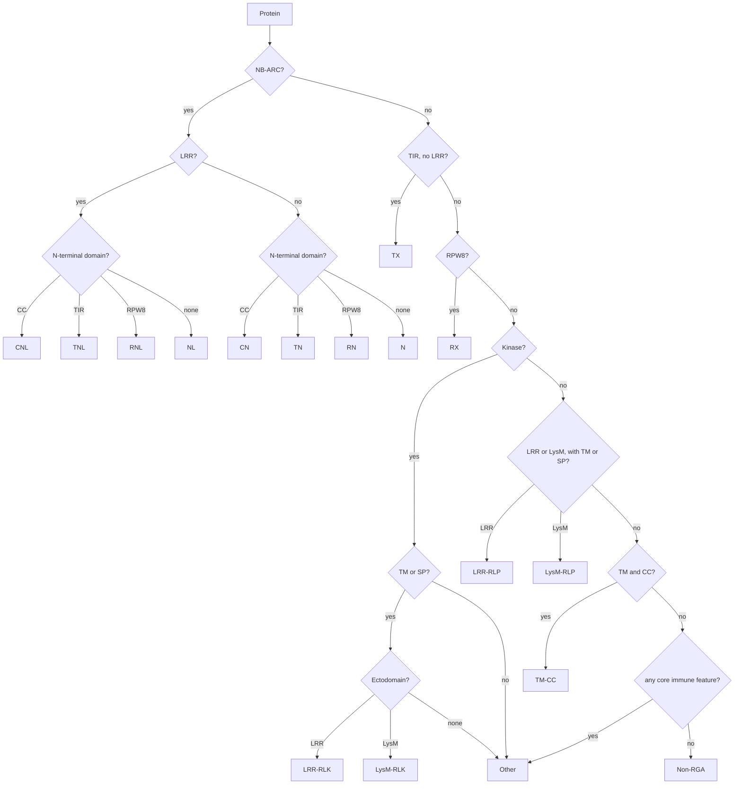

# Genome-wide prediction of Resistance Gene Analogs (RGAs)

A reproducible, organism-agnostic pipeline that turns pre-computed protein-annotation
outputs into a per-protein RGA call with an explicit, human-readable justification.

- Code: [`code/rgas/rgas_prediction.py`](../../code/rgas/rgas_prediction.py) and the
  [`code/rgas/rga/`](../../code/rga) package
- Configuration: [`code/rgas/config/rga_config.yaml`](../../code/rgas/config/rga_config.yaml)
- Tests: [`code/rgas/tests/`](../../code/rgas/tests)
- Architecture, design decisions and diagrams:
  [`ARCHITECTURE.md`](ARCHITECTURE.md)
- Second-pass code review: [`REVIEW_NOTES.md`](REVIEW_NOTES.md)
- Reference dataset: the *Saccharum officinarum* × *spontaneum* cv. R570 proteome
  (299,731 proteins over 194,593 loci)

---

## 1. Overview

### What an RGA is

Plant immunity operates in two layers (Jones & Dangl 2006). Cell-surface receptors,
**receptor-like kinases (RLKs)** and **receptor-like proteins (RLPs)**, detect conserved
microbial molecules outside the cell. Intracellular **NLRs** (nucleotide-binding
leucine-rich-repeat receptors) detect pathogen effectors that have entered the cytoplasm.
Both groups have highly characteristic domain architectures, so they can be recognised
from protein sequence alone.

A **Resistance Gene Analog** is a protein that carries the domain architecture of a
resistance protein. It is a *candidate*, identified from sequence features, not an
experimentally validated resistance gene.

### What this pipeline does

1. Reads the outputs of six annotation tools (InterProScan, Phobius, DeepTMHMM,
   SignalP 6.0, DeepLoc 2.0, DeepCoil2).
2. Harmonises them into one controlled vocabulary of nine features: `NB-ARC`, `TIR`,
   `RPW8`, `CC`, `LRR`, `STTK` (Ser/Thr & Tyr kinase), `LysM`, `TM`, `SP`.
3. Applies an ordered list of **mutually exclusive** classification rules and assigns the
   first class that fits.
4. Writes machine-readable tables, a report a biologist can read without any
   bioinformatics background, and a full reproducibility record.

### Relationship to Rody et al. (2019)

This pipeline is a reimplementation of the RGA survey of Rody et al. (2019) [1] for the
R570 proteome. **Rody et al. is the reference method**: it supplies every default, and
where another framework disagrees with it, the shipped configuration follows Rody. On top
of that baseline the pipeline **extends** the method in three ways, each an addition to
the published rules, not a replacement of one.

| extension | what Rody et al. do | what this pipeline does |
|---|---|---|
| **SP anchoring** | RLK/RLP require `TM`; a signal peptide is never used as a classification criterion | `SP` is accepted alongside `TM` as a membrane anchor (`any_of: [[TM, SP]]`) |
| **RPW8/RNL** | not modelled | `RPW8` is a first-class feature, giving the `RNL`, `RN` and `RX` classes |
| **RX-CC evidence** | coiled coils from Coils v2 / InterProScan Coils only | the Rx N-terminal CC domain (`PF18052`/`IPR041118`) is a CC channel alongside DeepCoil2 and InterProScan Coils (§5.4) |

None of the three removes a class or a rule Rody et al. define, and each is switchable
from the configuration alone (§8), but two of them do reassign proteins, and it is worth
being precise about which:

- **SP anchoring is the one that relaxes a published requirement.** Rody et al. require
  `TM`; this accepts `TM or SP`. It is one-directional, it can only let *more* proteins
  satisfy the anchor condition, never fewer, so it adds to `LRR-RLK`/`LRR-RLP` and takes
  from `Other`. Revert it by moving `TM` from `any_of` into `all_of` on the four RLK/RLP
  rules.
- **RPW8 reassigns within the NLR family.** `RNL`/`RN`/`RX` do not exist in Rody et al.,
  so a protein this pipeline calls `RNL` would be `CNL` or `NL` there 7 proteins in R570.
- **The Rx-CC channel only strengthens CC evidence.** It moves proteins `NL` → `CNL` and
  `N` → `CN`; it never removes a CC that Coils would have called, because the three
  channels combine under `union` (§5.4).

Where a Rody rule and an RGAugury rule genuinely conflict, the conflict is resolved for
Rody and the alternative is shipped disabled:

- **The RLK ectodomain requirement.** Rody et al. define an RLK as `TM + LRR or NB-LRR +
  kinase`, an ectodomain is *required*, so a kinase with a membrane anchor and no
  LRR/LysM is not an RLK. RGAugury instead calls RLKs on kinase + anchor and uses the
  ectodomain only to sub-type them, which yields a third subclass (`other-RLK`). This
  pipeline follows **Rody**: `LRR-RLK` and `LysM-RLK` are the only RLK subclasses, and a
  kinase + anchor protein with no recognised ectodomain falls through to `Other`. The
  RGAugury variant is kept as a commented-out `other-RLK` rule in
  [`rga_config.yaml`](../../code/rgas/config/rga_config.yaml); uncommenting it moves 5,527
  R570 proteins (3,422 loci) out of `Other` and into a new `other-RLK` subclass.

Two consequences worth stating whenever these numbers are quoted:

- **The `Non-RGA` class is not comparable between the two.** Rody et al. keep "only
  sequences harboring at least one out of three RGA basic domains, LRR, NB-ARC, or
  NB-LRR"; this pipeline classifies the entire input proteome. Percent-of-proteome
  figures therefore cannot be compared, only RGA class counts on a shared gene set.
- **Core detection agrees closely.** On the 77,883 genes both cover, per-feature Jaccard
  is 0.98 (LRR), 0.95 (NB-ARC, LysM) and 0.85 (kinase/STTK); `LRR-RLK` is 1,757 loci here
  against 1,721 in the legacy table. The headline divergences come from the three
  extensions above, not from the domain calls.

Each extension is also commented at the rule it affects in
[`rga_config.yaml`](../../code/rgas/config/rga_config.yaml).

### What this pipeline does *not* do

- It does not run the annotation tools. They must be run beforehand (§4).
- It does not align, cluster or phylogenetically place anything. There is no
  NB-ARC phylogeny, no orthology assignment and no synteny analysis.
- It does not decide whether a candidate is a functional resistance gene. That requires
  experimental validation.
- It does not de-duplicate isoforms in the main table. Every input protein gets exactly
  one row; a locus-level collapse is provided separately (§7).
- It does not detect features the input tools did not report. Missing HMM coverage,
  fragmented gene models and truncated proteins propagate directly into the results (§9).

---

## 2. Installation and dependencies

The project uses [`uv`](https://docs.astral.sh/uv/) for both the Python version and the
dependencies. From the repository root:

```bash
uv sync --extra dev      # creates .venv and installs everything
```

`pyproject.toml` pins:

| Requirement | Version used for the reference run |
|---|---|
| Python | 3.14.0 |
| pandas | 3.0.5 |
| numpy | 2.5.2 |
| PyYAML | 6.0.3 |
| pytest (dev only) | 9.1.1 |

There are no other runtime dependencies: no plotting library, no templating engine, no
network access. The HTML report draws its charts with hand-written inline SVG so that it
stays a single self-contained file.

The exact versions of the run that produced a given result directory are recorded in
`run_metadata.json` under `environment`.

---

## 3. How to use it

### 3.1 The shortest path

Once, to create the environment:

```bash
uv sync --extra dev
```

Then, from the repository root, this is the exact command that produced the reference
run shipped in `results/rgas/SaccharumR570/`, and the same command the report reprints
under "Reproduce this run":

```bash
uv run python code/rgas/rgas_prediction.py \
    --input-dir data/rgas/ \
    --outdir results/rgas/SaccharumR570/ \
    --organism-name SaccharumR570
```

That reproduces the reference run. Open `results/rgas/SaccharumR570/report.html` in a browser when it finishes, it is a
single self-contained file, so it can be emailed or copied anywhere.

Nothing is written outside `--outdir`, and nothing at all is written inside the input
directory.

### 3.2 The command line, in full

| Flag | Default | What it does |
|---|---|---|
| `--input-dir DIR` | `data/rgas` | where to look for the six tool outputs (§4) |
| `--outdir DIR` | `results/rgas/<organism>` | everything is written here |
| `--organism-name NAME` |, | label used in the report and the output directory |
| `--config FILE` | `code/rgas/config/rga_config.yaml` | accessions, thresholds and rules |
| `--interproscan`, `--phobius`, `--deeptmhmm`, `--signalp`, `--deeploc`, `--deepcoil` | auto-discovered | explicit path to one tool's output, overriding the glob |
| `--cc-policy` | `union` | `rx_domain` · `deepcoil` · `coils` · `union` · `intersection` (§5.4) |
| `--tm-policy` | `union` | `union` · `intersection` · `deeptmhmm` · `phobius` |
| `--sp-policy` | `signalp` | `union` · `intersection` · `signalp` · `phobius` |
| `--cc-threshold`, `--cc-min-length`, `--cc-max-gap` | `0.5`, `21`, `2` | DeepCoil2 segment calling, read §9 before changing |
| `--min-lrr-copies` | `1` | merged LRR intervals required before `LRR` is called |
| `--rga-only` / `--keep-non-rga` | keep all | whether `rga_predictions.tsv` holds the whole proteome |
| `--workers N` | `1` | processes used to read DeepCoil2 |
| `--refresh-deepcoil-cache` | off | re-read the DeepCoil2 archives instead of using `<outdir>/cache/` |
| `--log-level` | `INFO` | `DEBUG` · `INFO` · `WARNING` · `ERROR` |

Only `--interproscan` is mandatory in effect: the run aborts without it, and degrades
gracefully without any of the other five (§9), and the graceful-degradation matrix is in
[`ARCHITECTURE.md` §13](ARCHITECTURE.md#13-failure-modes-and-graceful-degradation).

### 3.3 Reading the results

Work outwards from the report:

1. **`report.html`**, the summary. Read the callout at the top before quoting a count.
   Section 3 reprints the command that produced it, ready to paste back; section 6 shows how much of each class the grading
   already flags as weak. The page is a single self-contained file with a fixed light
   palette, so it prints and screenshots the same for everyone.
2. **`rga_predictions.tsv`**, one row per protein, 51 columns (§7.1). This is the table
   to filter.
3. **`rga_predictions_by_locus.tsv`**, the same result with isoforms collapsed. In a
   polyploid genome this is usually the honest denominator.
4. **`rga_domain_evidence_long.tsv`**, one row per supporting hit, for when you need to
   see exactly which signature at which coordinates produced a call.

### 3.4 Recipes

Every column is a plain string or number, so ordinary tools work. `keep_default_na=False`
matters: missing values are the literal string `NA`, and pandas would otherwise read them
as `NaN` and hide them.

```python
import pandas as pd

pred = pd.read_csv("results/rgas/SaccharumR570/rga_predictions.tsv",
                   sep="\t", keep_default_na=False)

# every NLR the pipeline is confident about
nlr = pred[(pred.rga_family == "NLR") & (pred.confidence == "high")]

# CNLs whose coiled coil rests on the curated domain model rather than a predictor
cnl_domain = pred[(pred.rga_subclass == "CNL") & pred.cc_rx_domain]

# NLRs carrying an integrated domain, with the domain named
decoys = pred[pred.has_integrated_domain][
    ["protein_id", "rga_subclass", "integrated_domains",
     "integrated_domain_descriptions"]
]

# where is each domain? -- `feature_coords` is "NA" for a protein with no
# features, so guard for it, and split on the FIRST colon only because Gene3D
# accessions look like G3DSA:3.80.10.10
def coords(cell):
    if cell == "NA":
        return {}
    return dict(part.split(":", 1) for part in cell.split(";"))

nlr["coords"] = nlr.feature_coords.map(coords)
nlr.coords.iloc[0]["NB-ARC"]        # e.g. '191-361'
```

`is_rga`, `cc_rx_domain` and the other boolean columns come back as real `bool`, and the
counts as integers; only columns that can be missing (`sequence_length`, `cleavage_site`,
…) stay strings, holding the literal `NA`.

Column *positions* are not part of the contract, a new column can appear between
releases, so look them up by name:

```bash
cd results/rgas/SaccharumR570

# the RGA complement, without the 89 % of the proteome that is not one
# (rga_predictions_rga_only.tsv is this file, already written for you)
awk -F'\t' 'NR==1 {for (i=1;i<=NF;i++) c[$i]=i; print; next}
            $c["is_rga"]=="True"' rga_predictions.tsv > rgas_only.tsv

# how many high-confidence proteins per subclass (`NA` is the Non-RGA bucket:
# a protein with no immune feature is a confident negative, not an unknown)
awk -F'\t' 'NR==1 {for (i=1;i<=NF;i++) c[$i]=i; next}
            $c["confidence"]=="high" {n[$c["rga_subclass"]]++}
            END {for (k in n) print n[k], k}' rga_predictions.tsv | sort -rn
```

### 3.5 Things that will bite you

- **`--cc-policy` changes the answer.** `CNL` ranges from 185 to 2,648 across the five
  settings on the reference data (§9). The policy is recorded in `run_metadata.json`;
  quote it with any CC-dependent count.
- **The DeepCoil2 cache is keyed by path, not by checksum.** Pointing `--input-dir` at a
  different DeepCoil2 dataset while reusing an `--outdir` silently reuses the old cache.
  Pass `--refresh-deepcoil-cache` when you change inputs.
- **Counts are per protein, not per gene.** 1.54 proteins per locus in the reference
  proteome.
- **Re-running overwrites `--outdir`.** Use a new directory to keep a previous result.
- **`--min-lrr-copies` above 1 is a blunt instrument**, because region-level signatures
  collapse a whole LRR region to one interval (§5.2). Filter on `n_lrr_repeats` instead.

### 3.6 Checking a run finished correctly

```bash
grep -c "^" results/rgas/SaccharumR570/rga_predictions.tsv   # proteins + 1 header
tail -3 results/rgas/SaccharumR570/logs/run.log              # ends with "Done."
grep -i "warning" results/rgas/SaccharumR570/logs/run.log
```

The pipeline asserts its own invariants before writing anything, so a run that produced a
complete output directory and exited `0` has already checked that every input protein
appears exactly once, that no NLR lacks NB-ARC, and that the counts in the report, the
summary table and the metadata agree (§10). If an invariant fails, nothing is written.

---

## 4. Input specification

All six inputs are **read-only**; the pipeline never writes into the input directory.

Files are located under `--input-dir` using the glob patterns in the
`input_discovery` section of the configuration, and any of them can be overridden with an
explicit `--<tool>` path.

### 4.1 InterProScan 5, **required**

```bash
# Suggested canonical command; the exact command used for R570 was not recorded.
interproscan.sh -i proteome.fasta -f tsv -o r570_interpro.tsv \
                -appl Pfam,SMART,ProSiteProfiles,ProSitePatterns,PRINTS,CDD,Gene3D,SUPERFAMILY,PANTHER,Coils,NCBIfam \
                -goterms -pa -dp
```

Format: tab-separated, **no header**, 15 columns, 1-based inclusive coordinates in
columns 7 and 8.

```text
SoffiXsponR570.7_10Ag383000.3.p	c1e88cf6…	526	PANTHER	PTHR48041	ABC TRANSPORTER G FAMILY MEMBER 28	3	470	1.2E-121	T	09-08-2026	IPR050352	ATP-binding cassette subfamily G transporters	-	-
SoffiXsponR570.7_10Ag383000.3.p	c1e88cf6…	526	Pfam	PF00005	ABC transporter	2	53	3.0E-5	T	09-08-2026	IPR003439	ABC transporter-like, ATP-binding domain	-	-
SoffiXsponR570.7_10Ag383000.3.p	c1e88cf6…	526	Gene3D	G3DSA:3.40.50.300	-	1	118	2.8E-28	T	09-08-2026	IPR027417	P-loop containing nucleoside triphosphate hydrolase	-	-
```

> **InterProScan release.** The TSV records only the run date (`09-08-2026` for R570), not
> the InterProScan or InterPro release number. The release used for the reference run is
> therefore **`TODO`: not recoverable from the data**. Record it manually if you need to
> cite it.

### 4.2 Phobius, optional

```bash
phobius.pl -short proteome.fasta > r570.phobius
```

Format: whitespace-aligned short format (the header typo `SEQENCE ID` is Phobius's own).
The topology string encodes the signal peptide as `n<start>-<end>c<x>/<y>` and each
transmembrane helix as `<start>-<end>` between `i`/`o` markers.

```text
SEQENCE ID                     TM SP PREDICTION
SoffiXsponR570.7os1g052000.1.p  1  0 o50-70i
SoffiXsponR570.7os1g055400.1.p  1  Y n4-15c20/21o396-419i
```

### 4.3 DeepTMHMM, optional

```bash
python3 predict.py --fasta R570_proteome.fasta --output-dir R570/     # writes TMRs.gff3
```

Format: GFF3-like blocks separated by `//`, 4 significant columns, 1-based inclusive.
Region types observed in R570: `TMhelix`, `signal`, `inside`, `outside`, `Beta sheet`,
`periplasm`.

```text
# SoffiXsponR570.7os1g055400.1.p Length: 780
# SoffiXsponR570.7os1g055400.1.p Number of predicted TMRs: 1
SoffiXsponR570.7os1g055400.1.p	TMhelix	396	416
```

### 4.4 SignalP 6.0, optional

```bash
signalp6 --fastafile R570_proteome.fasta --organism other --output_dir R570/ --format txt --mode slow
```

Format: two `#` comment lines, then 9 tab-separated columns. **Column 1 is the entire
FASTA header**, not the protein ID; the pipeline keeps the first whitespace-delimited
token.

```text
# ID	Prediction	OTHER	SP(Sec/SPI)	LIPO(Sec/SPII)	TAT(Tat/SPI)	TATLIPO(Tat/SPII)	PILIN(Sec/SPIII)	CS Position
SoffiXsponR570.7os1g018900.1.p pacid=55934876 transcript=… org=…	SP	0.000177	0.999286	0.000145	0.000154	0.000123	0.000129	CS pos: 30-31. Pr: 0.9323
SoffiXsponR570.7os1g046800.1.p pacid=55934877 transcript=… org=…	OTHER	1.000000	0.000000	0.000000	0.000000	0.000000	0.000000	
```

### 4.5 DeepLoc 2.0, optional

```bash
deeploc2 --fasta R570_proteome.fasta --output R570/ --model Accurate
```

Format: CSV with a header. `Localizations` is **multi-label and pipe-separated**; the
per-class probability columns give the score of each label.

```text
Protein_ID,Localizations,Signals,Membrane types,Cytoplasm,Nucleus,Extracellular,Cell membrane,…
SoffiXsponR570.7os1g018900.1.p,Extracellular,Signal peptide,Soluble,0.1109,0.1091,0.8084,0.1371,…
SoffiXsponR570.7os1g046800.1.p,Nucleus,Nuclear localization signal,Soluble,0.1249,0.8997,0.0329,0.0809,…
```

### 4.6 DeepCoil2, optional but strongly recommended

```bash
deepcoil -i proteome.fasta -out_path deepcoil/ --n_cpu 8    # one .out file per protein
```

Format: one file per protein, named after a **sanitised** protein ID (for R570, the dots
are stripped: `SoffiXsponR570.01Bg000200.1.p` → `SoffiXsponR57001Bg0002001p.out`).
Each file has one row per residue.

```text
aa	cc	raw_cc	prob_a	prob_d
E	0.428	0.154	0.000	0.000
L	0.428	0.261	0.000	0.000
```

The pipeline reads `.out` files from a directory **or streams them straight out of
`.tar.xz` archives**, so a proteome split into 60 compressed parts (as R570 is) needs no
extraction. The parsed raw segments are cached in `<outdir>/cache/`; delete the cache or
pass `--refresh-deepcoil-cache` to re-read.

> **`cc` is not a per-residue probability.** DeepCoil2 has already performed peak
> detection: inside a candidate segment every residue carries the same plateau value and
> outside it the value is exactly `0`. `raw_cc` is the per-residue signal. Segment calling
> must therefore split on a *change of value*, not only on zeros, see §5.4.

### 4.7 Protein identifiers

Tools mangle identifiers differently. Normalisation is configured per tool in the `ids`
section and applied before anything is compared:

| Tool | Identifier as emitted | Normalisation |
|---|---|---|
| InterProScan | `PROT.1.p` | `strip_after_whitespace` |
| Phobius | `PROT.1.p` | `strip_after_whitespace` |
| DeepTMHMM | `PROT.1.p` | `strip_after_whitespace` |
| SignalP 6.0 | `PROT.1.p pacid=… org=…` | `strip_after_whitespace` |
| DeepLoc 2.0 | `PROT.1.p` | `strip_after_whitespace` |
| DeepCoil2 | `PROT1p.out` | reverse lookup via `strip_dots` |

Because the DeepCoil transformation is lossy, it cannot be inverted directly. Instead the
same transformation is applied to every canonical ID to build a lookup table, and the
pipeline **asserts that this mapping is injective** over the proteome before using it. For
R570 there are zero collisions across 299,731 proteins and all 299,731 DeepCoil files map
back to a canonical protein.

No protein is ever silently dropped. Every unmatched identifier, in either direction, is
written to `unmatched_ids_report.tsv` with a reason.

---

## 5. Methodology

### 5.1 Domain evidence, accession matching, never description matching

Feature assignment uses **accessions only**: the signature accession (InterProScan column
5) and the integrated InterPro accession (column 12). Description-string matching is
rejected because it is version-dependent and produces false positives, a regular
expression for `coil` matches `Coiled coil-helix-coiled coil-helix (CHCH) domain profile`
and `LRR_CC_2` (a *cysteine*-containing LRR), neither of which is a coiled coil.

`MobiDBLite` and `AntiFam` are excluded from evidence entirely.

The complete accession → feature mapping is printed in
[§5.10](#510-complete-accession--feature-mapping).

### 5.2 Interval merging and LRR copy number

Redundant databases report the same region repeatedly. All intervals of a given
protein × feature are merged (overlap ≥ `intervals.merge_min_overlap`, default 1 residue)
before anything is counted, so an LRR detected by Pfam, SMART and Gene3D counts once.
All coordinates are 1-based inclusive, in every tool, which is verified in §4.

Two LRR counts are reported:

- **`n_lrr`**, merged intervals from *every* LRR source. This is the count that
  `--min-lrr-copies` gates. Region-level signatures (`G3DSA:3.80.10.10`, SUPERFAMILY)
  span the entire LRR region, so a protein with a dozen repeats normally collapses to a
  single interval. Raising `--min-lrr-copies` above 1 is therefore a blunt filter.
- **`n_lrr_repeats`**, merged intervals from repeat-level signatures only
  (`intervals.lrr_repeat_analyses`, default Pfam/SMART/PRINTS/ProSitePatterns). This is
  the biologically meaningful copy number.

### 5.3 Transmembrane helices, and the signal-peptide artefact

Helices are read from **both** Phobius and DeepTMHMM. The consensus policy is
`--tm-policy {union, intersection, deeptmhmm, phobius}`, default **`union`**, matching
common practice; the policy actually used is logged and written to `run_metadata.json`.

**Signal peptides are routinely mis-called as transmembrane helices**, both are
hydrophobic α-helices. Any predicted helix covered by the signal-peptide region
(residues 1…`sp_end`) by at least `transmembrane.sp_overlap_fraction` of its own length
(default 0.5) is discarded. `sp_end` is the most conservative estimate available: the
maximum over SignalP's cleavage site, Phobius's `c` position and DeepTMHMM's own `signal`
region.

Both the raw and the filtered helix counts are reported (`n_tm_phobius_raw` versus
`n_tm_phobius`), together with `n_tm_dropped_in_sp`, so the effect of the filter is always
visible.

### 5.4 Coiled coils, three channels, and why the domain model leads

The coiled coil is the weakest link in any RGA survey: it decides `CNL` against `NL`,
and it is the one feature this pipeline used to take from a source of a different
evidential class than all the others. **The current configuration fixed that.** There are now three
CC channels:

| Channel | Kind of evidence | Accession / parameters |
|---|---|---|
| `rx_domain` | **profile HMM for a named domain**, curated, versioned, stable accession | `PF18052` / `IPR041118`, Rx N-terminal domain |
| `deepcoil` | learned per-residue propensity score | DeepCoil2, thresholded at `cc_threshold` over `cc_min_length` |
| `coils` | profile-based propensity (Lupas 1991) | InterProScan `Coils` / accession `Coil` |

**Why a third channel, and why it leads.** The other eight features of the controlled
vocabulary are called from curated domain models: NB-ARC from `PF00931`, TIR from
`PF01582`, LysM from `PF01476`. Calling the ninth from an unbenchmarked propensity score
was an inconsistency at the heart of the rule set, and the R570 data shows what it cost.

Neither predictor publishes a recommended cut-off. The DeepCoil documentation describes
its `cc` column only as *"sharpened coiled coil propensity"*; Ludwiczak et al. (2019)
report AUC/ROC and F1, metrics that sweep every threshold precisely so that none has to
be chosen, and name a cut-off exactly once, *"a very strict cut-off of 0.9"*, used to mine
the human genome for high-confidence **novel** coiled coils. That is a discovery cut-off,
not an annotation one, and §9 shows what it does to this proteome.

Meanwhile Simm et al. (2021) re-evaluated the coiled-coil predictors against the entire
PDB via SOCKET and found a **30-fold spread** in how many coiled coils they call
(PairCoil 1,307 PDB files, NCOILS 37,177) and agreement with structure close to random:
*"the MCC indicates random prediction in case of NCOILS (MCC of 0.02) and close to random
prediction for all other tools (MCC of 0.22 for MultiCoil2 being the highest value)"*.
DeepCoil was **excluded** from that benchmark, it was limited to 500 residues at the time
and mis-predicted a coiled coil at the first IQ motif of myosin-X, so it has no
independent structural benchmark either way.

Against that, `PF18052` is an ordinary curated Pfam entry with an integrated InterPro
accession. A biologist can look it up, cite it and disagree with it. "DeepCoil2 plateau
≥ 0.5 over ≥ 21 residues" is a parameter choice they cannot.

**What the R570 data says.** Within the 4,023 NLRs:

| | NLRs |
|---|---|
| Rx domain (`PF18052`) | **2,611** |
| InterProScan Coils | 1,836 |
| DeepCoil2 (0.5 / 21) | 479 |
| Rx **and** DeepCoil2 | 377 |
| Rx **and** Coils | 1,463 |
| DeepCoil2 with neither Rx nor Coils | **33** |
| none of the three | 1,006 |

Read the fourth row against the third: **377 of the 479 DeepCoil2-positive NLRs (79 %)
already carry the Rx domain.** DeepCoil2 is overwhelmingly rediscovering this domain, at
roughly 14 % recall, and contributes 33 NLRs that nothing else supports.

And the cost of leaving the domain out, under the old default:

> **2,003 of the 3,038 proteins called `NL` (66 %) carry `PF18052`**, two thirds of the
> largest NLR class were proteins holding the coiled-coil domain of an Rx-type CNL, reported
> as NLRs with no coiled coil.

That is not conservatism; it is systematic error, and it is why the channel is now on by
default.

**The bound on the claim, stated plainly.** `PF18052` models the CC of **Rx/Gpa2-type**
CNLs. It is not "the" NLR coiled-coil domain. The 1,006 R570 NLRs positive for none of the
three channels remain CC-negative, so `CNL` is still a floor, a much higher and much
better-supported floor than before, but a floor.

**Segment calling (the DeepCoil2 channel).** All parameters live under `coiled_coil`:

1. Discard raw segments whose plateau score is below `threshold` (default `0.5`).
2. Merge surviving segments separated by at most `max_gap` residues (default `2`).
3. Discard merged segments shorter than `min_length` (default `21` residues = 3 heptads).

Gap merging deliberately happens **before** the length filter, so a genuine coiled coil
interrupted by one or two sub-threshold residues is not lost.

`min_length: 21` is the one CC constant with real support: coiled coils shorter than three
heptads are generally unstable, and Simm et al. (2021) evaluated every predictor under
exactly two length cut-offs, **14 and 21 residues**, reporting that *"the prediction tools
show increasing performance when applying the 14 and then the 21 amino acid cut-offs
compared to no length cut-off"*, with the caveat that *"the increase in sensitivity comes
to the cost of precision, which decreases by 5–17%"*. `threshold: 0.5` has no such support
and is documented in the configuration as a deliberate midpoint choice, not a default.

> **`cc` is not a per-residue probability.** DeepCoil2 has already performed peak
> detection: inside a candidate segment every residue carries the same plateau value and
> outside it the value is exactly `0`. `raw_cc` is the per-residue signal. Segment calling
> must therefore split on a *change of value*, not only on zeros.

Observed score distribution over R570 part_001 (2,317,452 residues): maximum `0.922`,
`cc > 0` for 6.22 % of residues, `≥ 0.2` for 4.58 %, `≥ 0.5` for 2.43 %, `≥ 0.9` for
0.03 %. Scores are on a 0–1 scale but never reach 1.0.

Recorded per protein: `n_cc_segments`, `cc_max_prob`, `cc_mean_prob_in_segments`
(length-weighted), `cc_coords`, `cc_total_length`.

**Consensus policy.** `--cc-policy {union, intersection, rx_domain, deepcoil, coils}`,
default **`union`**. `cc_rx_domain`, `cc_deepcoil`, `cc_coils`, `cc_consensus` and
`cc_source` are all stored, so the consensus never hides which channel fired.
`cc_source` names every contributing channel, `rx_domain+deepcoil+coils`,
`rx_domain_only`, `deepcoil_only`, `coils_only`, and so on.

> **`union` and `intersection` range over three channels, not two.** A
> `cc_policy_sensitivity.tsv` produced by an earlier two-channel configuration is not
> comparable column-for-column with one produced here; the config version is recorded in
> `run_metadata.json` for exactly this reason.

**Coordinates follow the channel that fired.** DeepCoil2 resolves a segment per residue, so
its intervals are used whenever it called; otherwise the domain hit's span is used, and
failing that the Coils span. The long evidence table attributes each interval to its own
tool, so a CC called by the domain model is never exported as a DeepCoil2 hit.

**N-terminal positional check.** In canonical CNLs the coiled coil lies N-terminal to the
NB-ARC domain. `cc_is_n_terminal` records whether *every* called CC segment ends before
the first NB-ARC residue. This is **informative, never a filter**: a CNL whose only CC
segment sits C-terminal to the NB-ARC keeps its CNL call, gains a warning, and is demoted
one confidence level.

**CC/TM cross-talk.** Hydrophobic helices make coiled-coil and transmembrane predictors
fire on the same region. When a CC segment is covered by a predicted TM helix by more than
`coiled_coil.tm_overlap_fraction` (default 0.5), `cc_tm_ambiguous` is set, both features
are kept, the confidence is demoted and a warning is raised. This matters most for the
`TM-CC` class, which is defined by exactly these two features.

**If DeepCoil2 is absent**, the CC channel degrades to the domain model plus InterProScan
Coils, a prominent warning is logged, and predictor-only calls are graded down as usual.
The domain channel needs only InterProScan, so unlike in a DeepCoil2-only setup a missing DeepCoil2 no
longer makes every CC-dependent NLR call low-confidence.

**The family-level RPW8 signature was correctly rejected, and the contrast with `PF18052`
is the point.** PANTHER `PTHR36766` ("PLANT BROAD-SPECTRUM MILDEW RESISTANCE PROTEIN
RPW8") hits 1,378 proteins, **1,273 of which carry NB-ARC**. That ratio is the diagnosis: a
genuine RPW8 domain model would have no reason to land on NLRs 92 % of the time. It is a
**family-level** signature, "this whole protein resembles a cluster the curators named
after RPW8", not a statement that any particular region is an RPW8 domain. Had it been
used as evidence, `RNL` would have gone from 7 to roughly 1,273 and, because `RNL` outranks
`CNL` and `NL`, it would have swallowed most of the NLR complement. It stays in
`watch_accessions`, counted in `accession_audit.tsv`, never used. `PF18052` is the opposite
case, a domain-level model, positional and specific, which is why it was promoted while
`PTHR36766` was not.


### 5.5 Signal peptides

SignalP 6.0 classes counted as a signal peptide: `SP`, `LIPO`, `TAT`, `TATLIPO`, `PILIN`
(configurable). By default SignalP's own argmax decision is trusted;
`signal_peptide.min_probability` adds an optional probability floor.
`--sp-policy {union, intersection, signalp, phobius}` defaults to **`signalp`**, the more
accurate dedicated predictor. `sp_signalp`, `sp_prob`, `sp_phobius`, `sp_consensus` and
`cleavage_site` are all stored.

### 5.6 DeepLoc 2.0, supporting evidence only

Localisation **never** decides a class. It is used to:

- populate `predicted_localization`, `localization_prob` and `all_localizations`;
- raise or lower the *confidence* of RLK/RLP/TM-CC calls through membrane support;
- flag inconsistencies (an NLR predicted extracellular, a receptor predicted soluble) in
  the `warnings` column.

### 5.7 Confidence formula

Every protein starts at **`high`** and is demoted one level per triggered rule, floored at
`low`. The rules are declared in `confidence.demotions` and evaluated in order:

| Demotion | Fires when | Levels |
|---|---|---|
| `cc_deepcoil_only` | CC-dependent class; **no CC domain model**, DeepCoil2 called the CC and InterProScan Coils did not | −1 |
| `cc_coils_only` | CC-dependent class; **no CC domain model**, only InterProScan Coils supports the CC | −2 |
| `cc_tm_ambiguous` | CC-dependent class; a CC segment overlaps a predicted TM helix | −2 |
| `cc_not_n_terminal` | CC-dependent class; the CC lies C-terminal to the NB-ARC | −1 |
| `deeploc_inconsistent` | DeepLoc contradicts the class (NLR extracellular / membrane; receptor not membrane-associated) | −1 |
| `missing_channel` | the class depends on a channel whose tool was not supplied | −2 |

CC-dependent classes are `CNL`, `CN`, `TM-CC`. The two predictor-only demotions carry
`cc_rx_domain: false` in their `when` clause, which encodes the evidence hierarchy
directly: **a CC backed by the domain model is never demoted for its CC.** A curated
profile HMM with a stable accession is the same grade of evidence as the `PF00931` hit
that made the protein an NLR in the first place, and grading one down while trusting the
other would be incoherent.

So, for a CC-dependent call:

| CC evidence | Grade |
|---|---|
| Rx domain (with or without predictor support) | `high` |
| DeepCoil2 **and** Coils, no domain model | `high` |
| DeepCoil2 only, no domain model | `medium` |
| Coils only, no domain model | `low` |
| any of the above, TM-ambiguous | −2 further |

`confidence_demotions` lists exactly which rules fired, so the grade is never opaque.

### 5.8 The `reason` field

Every row carries a sentence generated **from the evidence table**, there is no per-class
template, so the text always reflects what the pipeline actually saw:

```text
Rule CNL (priority 1): NB-ARC [PF00931 @ 180-346], CC [deepcoil+coils @ 70-91],
LRR [G3DSA:3.80.10.10 @ 540-811]. Excluded: no TIR, no RPW8.
TM: none (Phobius 0 / DeepTMHMM 0). SP: none (SignalP6 OTHER 1.000).
CC: present (DeepCoil2 1 segment(s), max score 0.670; Coils yes) at 70-91.
CC is N-terminal to NB-ARC. DeepLoc: Nucleus (0.59) -- consistent. Confidence: high.
```

### 5.9 Integrated domains

For NLRs only, any domain from `integrated_domain_analyses` (Pfam by default) that does
not belong to `integrated_domain_canonical_features` and is not in
`integrated_domain_exclusions` is reported as an **integrated domain**, the fusion of a
non-canonical domain to an NLR, central to the integrated-decoy model of effector
recognition.

The exclusion list matters more than it sounds. Without it the *structural* sub-domains of
an ordinary NLR are flagged as integrations: the winged-helix domain of the NB-ARC module
(`PF23559`, on 3,407 R570 NLRs), the Rx-type N-terminal coiled coil (`PF18052`, 2,611) and
the family-specific LRR models (`PF25019`, 1,032). With them excluded, R570 gives:

| Integrated domain | Pfam | NLRs |
|---|---|---|
| Protein kinase | `PF00069` + `PF07714` | 134 |
| EDR4 zinc-ribbon / EDR4-like N-terminal | `PF11331` + `PF22910` | 60 |
| WRKY DNA-binding | `PF03106` | 18 |
| Jacalin-like lectin | `PF01419` | 17 |
| WD40 / G-beta repeat | `PF00400` | 17 |
| BED zinc finger | `PF02892` | 15 |

**285 of the 4,023 NLRs (7.1 %)** carry at least one integrated domain. The composition is
what the literature leads one to expect for a grass, kinase, WRKY and BED fusions
dominate, which is a useful independent check that the exclusion list is drawn in the
right place.

### 5.10 Complete accession → feature mapping

Hit counts are from the R570 reference run (InterProScan, 3,180,078 rows,
run date 09-08-2026). `0` marks an accession that is seeded in the config but
was not observed in this proteome; it is kept so the configuration stays portable.

| Feature | Database | Accession | Hits in R570 |
|---|---|---|---|
| `NB-ARC` | Pfam | `PF00931` | 4,369 |
| `NB-ARC` | InterPro | `IPR002182` | 4,369 |
| `NB-ARC` | Pfam | `PF05729` | 0 |
| `TIR` | Pfam | `PF01582` | 15 |
| `TIR` | Pfam | `PF13676` | 16 |
| `TIR` | SMART | `SM00255` | 15 |
| `TIR` | InterPro | `IPR000157` | 99 |
| `TIR` | PROSITE | `PS50104` | 53 |
| `TIR` | SUPERFAMILY | `SSF52200` | 51 |
| `TIR` | InterPro | `IPR035897` | 104 |
| `RPW8` | Pfam | `PF05659` | 0 |
| `RPW8` | PROSITE | `PS51153` | 7 |
| `RPW8` | InterPro | `IPR008808` | 7 |
| `LRR` | Pfam | `PF00560` | 14,738 |
| `LRR` | Pfam | `PF07723` | 0 |
| `LRR` | Pfam | `PF07725` | 0 |
| `LRR` | Pfam | `PF12799` | 303 |
| `LRR` | Pfam | `PF13306` | 31 |
| `LRR` | Pfam | `PF13516` | 644 |
| `LRR` | Pfam | `PF13855` | 4,400 |
| `LRR` | Pfam | `PF14580` | 23 |
| `LRR` | SMART | `SM00365` | 1,868 |
| `LRR` | SMART | `SM00369` | 18,431 |
| `LRR` | SMART | `SM00370` | 0 |
| `LRR` | InterPro | `IPR001611` | 22,104 |
| `LRR` | InterPro | `IPR003591` | 18,431 |
| `LRR` | InterPro | `IPR032675` | 21,512 |
| `LRR` | Pfam | `PF23598` | 4,482 |
| `LRR` | InterPro | `IPR055414` | 4,482 |
| `LRR` | SMART | `SM00367` | 4,175 |
| `LRR` | InterPro | `IPR006553` | 4,175 |
| `LRR` | Pfam | `PF08263` | 2,596 |
| `LRR` | InterPro | `IPR013210` | 2,596 |
| `LRR` | PROSITE | `PS51450` | 2,322 |
| `LRR` | PRINTS | `PR00019` | 2,956 |
| `LRR` | Pfam | `PF23247` | 336 |
| `LRR` | InterPro | `IPR057135` | 336 |
| `LRR` | Gene3D | `G3DSA:3.80.10.10` | 21,512 |
| `STTK` | Pfam | `PF00069` | 9,304 |
| `STTK` | Pfam | `PF07714` | 6,744 |
| `STTK` | SMART | `SM00220` | 12,583 |
| `STTK` | SMART | `SM00219` | 238 |
| `STTK` | PROSITE | `PS50011` | 15,857 |
| `STTK` | InterPro | `IPR000719` | 37,744 |
| `STTK` | InterPro | `IPR001245` | 9,627 |
| `STTK` | InterPro | `IPR011009` | 16,725 |
| `LysM` | Pfam | `PF01476` | 159 |
| `LysM` | SMART | `SM00257` | 178 |
| `LysM` | InterPro | `IPR018392` | 657 |
| `LysM` | CDD | `cd00118` | 141 |
| `LysM` | SUPERFAMILY | `SSF54106` | 119 |
| `LysM` | InterPro | `IPR036779` | 308 |
| `LysM` | Gene3D | `G3DSA:3.10.350.10` | 189 |
| `CC` | InterProScan Coils | `Coil` | 72,088 |

The domain-level CC channel (`cc_domain_accessions`, §5.4) is configured separately so
that `cc_coils` keeps its documented meaning:

| Channel | Database | Accession | Hits in R570 |
|---|---|---|---|
| `rx_domain` | Pfam | `PF18052` | 2,827 |
| `rx_domain` | InterPro | `IPR041118` | 2,827 |

Accessions recorded but deliberately **not** used as evidence (`watch_accessions`):

| Accession | Hits in R570 | Why it is excluded |
|---|---|---|
| `PTHR36766` | 1,378 | PANTHER: PLANT BROAD-SPECTRUM MILDEW RESISTANCE PROTEIN RPW8. **Family-level**, not domain-level: 1,273 of its 1,378 hits carry NB-ARC, which is the diagnosis, a real RPW8 domain model would have no reason to land on NLRs 92 % of the time. Using it would take `RNL` from 7 to ~1,273 and, since `RNL` outranks `CNL` and `NL`, swallow most of the NLR complement |
| `PTHR33463` | 412 | PANTHER: NB-ARC DOMAIN-CONTAINING PROTEIN-RELATED (family-level, not used as NB-ARC evidence) |

Contrast this with `PF18052`, which *is* used as evidence here: it is a
**domain-level** model, positional, specific, with a stable accession, whereas
`PTHR36766` is a whole-protein family label named after its best-studied member. The
distinction between the two is the whole basis of both decisions.

---

## 6. Classification rules

### 6.1 Decision flow



### 6.2 The rule table

The reference scheme, quoted from the Methods of Rody et al. (2019):

> "1) TM-LRR encoding family: RLK (TM + LRR or NB-LRR + kinase domains), RLP (TM + LRR or
> NB-LRR or LysM); 2) NBS-LRR encoding family: TN (TIR + NBS/NB/NB-ARC), TNL (TIR + NB-ARC
> + LRR or NB-LRR), CN (CC + NB-ARC), CNL (CC + NB-ARC + LRR or NB-LRR); 3) Other domains
> combinations: TM-CC (TM + CC), TIR (TIR), Other variants."

Every rule below falls into one of three groups against that scheme:

- **implements one of their combinations directly**, `TN`, `TNL`, `CN`, `CNL`,
  `LRR-RLK`, `LysM-RLK`, `LRR-RLP`, `LysM-RLP`, `TM-CC`, and `TX` for their `TIR` class;
- **names one of their "Other variants"**, `NL` and `N`, NB-ARC carriers with no
  N-terminal `CC`/`TIR` domain, which their scheme leaves unlabelled;
- **is part of the RPW8 extension**, `RNL`, `RN` and `RX`, which have no counterpart in
  their scheme because RPW8 is not among their features (§1).

Rules are evaluated in priority order and the first match wins. Priorities 1–17 are
written so that they are mutually exclusive **independently of their order**; priorities
18–19 are ordered catch-alls. **Priority 13 is deliberately vacant**: it belongs to the
opt-in `other-RLK` rule, which is shipped commented out because Rody et al. require an
ectodomain for an RLK (§1). Priorities are labels, not positions, so the gap is inert,
`rule_priority` in the output tables and the `reason` strings refer to these numbers, and
they stay stable whether or not the rule is enabled.

| # | Rule | Family | Requires | Requires one of | Forbids |
|---|---|---|---|---|---|
| 1 | `CNL` | NLR | NB-ARC, CC, LRR |, | TIR, RPW8 |
| 2 | `TNL` | NLR | NB-ARC, TIR, LRR |, | RPW8 |
| 3 | `RNL` | NLR | NB-ARC, RPW8, LRR |, |, |
| 4 | `NL` | NLR | NB-ARC, LRR |, | CC, TIR, RPW8 |
| 5 | `CN` | NLR | NB-ARC, CC |, | LRR, TIR, RPW8 |
| 6 | `TN` | NLR | NB-ARC, TIR |, | LRR, RPW8 |
| 7 | `RN` | NLR | NB-ARC, RPW8 |, | LRR |
| 8 | `N` | NLR | NB-ARC |, | CC, TIR, RPW8, LRR |
| 9 | `TX` | NLR-associated | TIR |, | NB-ARC, LRR |
| 10 | `RX` | NLR-associated | RPW8 |, | NB-ARC, TIR |
| 11 | `LRR-RLK` | RLK | STTK, LRR | TM or SP | NB-ARC, TIR, RPW8 |
| 12 | `LysM-RLK` | RLK | STTK, LysM | TM or SP | NB-ARC, TIR, RPW8, LRR |
| 14 | `LRR-RLP` | RLP | LRR | TM or SP | NB-ARC, TIR, RPW8, STTK |
| 15 | `LysM-RLP` | RLP | LysM | TM or SP | NB-ARC, TIR, RPW8, STTK, LRR |
| 16 | `other-RLP` | RLP |, | (TM or SP) and (ectodomain) | NB-ARC, TIR, RPW8, STTK, LRR, LysM |
| 17 | `TM-CC` | TM-CC | TM, CC |, | NB-ARC, STTK, LRR, LysM, TIR, RPW8 |
| 18 | `Other` | Other | at least one core immune feature |, |, |
| 19 | `Non-RGA` | Non-RGA | no core immune feature |, |, |

Notes on the design:

- **Mutual exclusivity is proved, not asserted in a comment.**
  `rules.find_overlapping_rules()` enumerates all 2⁹ = 512 subsets of the feature
  vocabulary and checks that no two non-fallback rules fire on the same one. The pipeline
  runs this check at startup and `test_rules.py` runs it in CI. A second test checks that
  ordered evaluation assigns exactly one class to every one of the 512 combinations.
- **`other-RLP` is deliberately unreachable** with the default `ectodomain_features`
  (`[LRR, LysM]`), because both already have their own rule. It exists so that a config
  which adds a third ectodomain feature gets an RLP subclass for free, and it is reported
  with a count of 0. A test asserts this.
- **TIR outranks kinase.** A TIR protein with a kinase domain and no NB-ARC or LRR is
  `TX`, not an RLK. This follows the priority order of the specification; it is stated
  here because it is a real biological decision (IRAK-like TIR-kinases exist).
- **A lone coiled coil is not immune evidence.** `core_immune_features` deliberately
  excludes `CC`. This sits *between* the two filters Rody et al. apply. Their published
  filter is stricter, "only sequences harboring at least one out of three RGA basic
  domains, LRR, NB-ARC, or NB-LRR, were kept", while their script's working universe is
  broader, admitting any protein with an LRR, NB-ARC, TIR, kinase, CC or TM hit. Under
  that broader universe every protein with a predicted coiled coil, 42,300 in R570 by
  InterProScan Coils alone, is reported as an `Other` RGA. Excluding `CC` reproduces
  neither exactly; it keeps the classes Rody et al. define that their published filter
  would drop (`TM-CC` in particular) without letting a generic structural motif stand
  alone as immune evidence. To restore the script's universe, add `CC` to
  `core_immune_features`; nothing else changes.

### 6.3 One worked example per class

Every example below is a real R570 protein; the `reason` column of
`rga_predictions.tsv` carries the full trace.

| Class | n in R570 | Example protein | Architecture | Confidence |
|---|---|---|---|---|
| `CNL` | 2,648 | `SoffiXsponR570.01Ag189500.1.p` | `CC-NB-ARC-LRR` | high |
| `TNL` | 0 |, |, |, |
| `RNL` | 7 | `SoffiXsponR570.09Ag135100.1.p` | `RPW8-NB-ARC-LRR` | high |
| `NL` | 786 | `SoffiXsponR570.01Ag021800.1.p` | `NB-ARC-LRR` | high |
| `CN` | 358 | `SoffiXsponR570.01Bg125700.1.p` | `CC-NB-ARC` | high |
| `TN` | 33 | `SoffiXsponR570.03Ag132500.1.p` | `TIR-NB-ARC` | high |
| `RN` | 0 |, |, |, |
| `N` | 191 | `SoffiXsponR570.01Ag185600.1.p` | `NB-ARC` | high |
| `TX` | 20 | `SoffiXsponR570.05Ag076500.1.p` | `TIR` | high |
| `RX` | 0 |, |, |, |
| `LRR-RLK` | 2,992 | `SoffiXsponR570.01Ag036700.1.p` | `LRR-TM-STTK` | high |
| `LysM-RLK` | 45 | `SoffiXsponR570.01Ag452300.1.p` | `SP-LysM-TM-STTK` | high |
| `LRR-RLP` | 1,238 | `SoffiXsponR570.01Ag021100.1.p` | `SP-LRR` | high |
| `LysM-RLP` | 80 | `SoffiXsponR570.01Ag521200.1.p` | `SP-LysM-TM` | high |
| `other-RLP` | 0 |, |, |, |
| `TM-CC` | 8,105 | `SoffiXsponR570.01Ag051400.1.p` | `CC-TM` | high |
| `Other` | 16,793 | `SoffiXsponR570.01Ag001100.1.p` | `STTK` | high |
| `NA` | 266,435 | `SoffiXsponR570.01Ag000100.1.p` | `NA` | high |

Full traces for one representative of each of the five families:

**`CNL`, `SoffiXsponR570.01Ag189500.1.p`**, a CC called by the domain model alone. Under
a DeepCoil2-only CC policy this protein is an `NL`.

```text
Rule CNL (priority 1): NB-ARC [PF00931 @ 191-361], CC [rx_domain_only @ 9-103], LRR [G3DSA:3.80.10.10 @ 595-1086, SM00369 @ 615-638, SM00369 @ 661-683, SM00369 @ 909-933]. Excluded: no TIR, no RPW8. TM: none (Phobius 0 / DeepTMHMM 0). SP: none (SignalP6 OTHER 1.000). CC: present (DeepCoil2 0 segment(s); Rx domain yes; Coils no) at 9-103. CC is N-terminal to NB-ARC. DeepLoc: Nucleus (0.71) -- consistent. Confidence: high.
```

**`LRR-RLK`, `SoffiXsponR570.01Ag036700.1.p`**

```text
Rule LRR-RLK (priority 11): STTK [PF07714 @ 223-494, PS50011 @ 220-499, SM00220 @ 220-494, SSF56112 @ 202-495], LRR [G3DSA:3.80.10.10 @ 3-141, PF00560 @ 26-47, PF00560 @ 49-71, PF00560 @ 73-94], TM [154-176]. Excluded: no NB-ARC, no TIR, no RPW8. TM: present (Phobius 1 / DeepTMHMM 1). SP: none (SignalP6 OTHER 1.000). CC: none (DeepCoil2 0 segment(s); Rx domain no; Coils no). DeepLoc: Cell membrane (0.91) -- consistent. Confidence: high.
```

**`LRR-RLP`, `SoffiXsponR570.01Ag021100.1.p`**

```text
Rule LRR-RLP (priority 14): LRR [G3DSA:3.80.10.10 @ 240-328, G3DSA:3.80.10.10 @ 329-509, G3DSA:3.80.10.10 @ 35-239, PF00560 @ 317-338, +4 more], SP [cleavage site 34-35]. Excluded: no NB-ARC, no TIR, no RPW8, no STTK. TM: none (Phobius 0 / DeepTMHMM 0). SP: present (SignalP6 SP 0.999, CS 34-35). CC: none (DeepCoil2 0 segment(s); Rx domain no; Coils no). DeepLoc: Extracellular (0.60) -- consistent. Confidence: high.
```

**`TM-CC`, `SoffiXsponR570.01Ag051400.1.p`**

```text
Rule TM-CC (priority 17): TM [194-213], CC [deepcoil+coils @ 130-179]. Excluded: no NB-ARC, no STTK, no LRR, no LysM, no TIR, no RPW8. TM: present (Phobius 1 / DeepTMHMM 1). SP: none (SignalP6 OTHER 1.000). CC: present (DeepCoil2 1 segment(s), max score 0.705; Rx domain no; Coils yes) at 130-179. DeepLoc: Cell membrane (0.61) -- consistent. Confidence: high.
```

**`Other`, `SoffiXsponR570.01Ag001100.1.p`**

```text
Rule Other (priority 18): STTK [PF07714 @ 898-1158, PR00109 @ 1015-1033, PR00109 @ 1086-1108, PR00109 @ 1130-1152, +4 more]. TM: none (Phobius 0 / DeepTMHMM 0). SP: none (SignalP6 OTHER 1.000). CC: none (DeepCoil2 0 segment(s); Rx domain no; Coils no). DeepLoc: Cytoplasm (0.57) -- consistent. Confidence: high.
```

**`Other`, `SoffiXsponR570.01Ag020500.1.p`**, the anchored kinase with no recognised
ectodomain. RGAugury would call this an `other-RLK`; Rody et al. require an ectodomain, so
it stays in `Other` (§1). 5,527 R570 proteins land here for this reason, and they are the
single largest block of the `Other` class.

```text
Rule Other (priority 18): SP [cleavage site 27-28], STTK [PF00069 @ 501-773, PS50011 @ 498-779, SM00220 @ 498-775, SSF56112 @ 480-776], TM [437-461]. TM: present (Phobius 1 / DeepTMHMM 1). SP: present (SignalP6 SP 0.999, CS 27-28). CC: none (DeepCoil2 0 segment(s); Rx domain no; Coils no). DeepLoc: Cell membrane (0.77) -- consistent. Confidence: high.
```

Classes with zero members in R570: `TNL`, `RN`, `RX`, `other-RLP`.
`TNL` and `RN`/`RX` are biologically expected to be rare or absent in a grass;
`other-RLP` is unreachable by design (§6.2). `other-RLK` is absent from the table
entirely: the rule is shipped disabled (§1, §6.2).

### 6.4 Choosing a rule set: Rody, Rody + RGAugury, or your own

The shipped default is **Rody et al. (2019) plus the three extensions of §1**, call it
*Rody-extended*. Every other combination is reached by editing
[`rga_config.yaml`](../../code/rgas/config/rga_config.yaml), no code changes. Only the
consensus policies of row 4 also have a command-line flag (`--cc-policy`); the rule
switches deliberately do not, because a change of method belongs in the recorded
configuration rather than in a shell history. Either way `run_metadata.json` stores the
fully resolved configuration, so a result always carries the rule set that produced it.

| preset | what you get | changes from the shipped default |
|---|---|---|
| **Rody-extended** *(default)* | the published Rody et al. rules, plus SP anchoring, RPW8/RNL and the Rx CC channel | none |
| **Rody, as published** | the published rules only | revert all three extensions (rows 2–4 below) |
| **Rody + RGAugury** | the default plus RGAugury's RLK scope | enable row 1 below |
| **Your own** | anything | add rules; §8 |

Each switch is independent, mix them freely:

| # | switch | key | shipped | to change it |
|---|---|---|---|---|
| 1 | **RLK ectodomain requirement** (the one Rody/RGAugury conflict) | `rules`, priority 13 | Rody: ectodomain required | uncomment the `other-RLK` block. Adds an `other-RLK` subclass; 5,527 R570 proteins move out of `Other` |
| 2 | **SP as a membrane anchor** | `any_of: [[TM, SP]]` on the four RLK/RLP rules | on (extension) | delete the `any_of` line and add `TM` to `all_of`. `other-RLP` carries the same group and is unreachable either way |
| 3 | **RPW8 features and classes** | `interproscan_features.RPW8` | on (extension) | set the accession list to `[]`. The `RNL`/`RN`/`RX` rules stay in the file and simply never fire |
| 4 | **Rx CC domain channel** | `cc_domain_accessions` | on (extension) | set to `[]` and `policies.cc: coils` for the published Coils-only behaviour, or `policies.cc: deepcoil` for this pipeline's earlier default (§5.4) |
| 5 | **CC as core immune evidence** | `core_immune_features` | off | add `CC` to restore the working universe of the Rody et al. script (§6.2). Not part of any preset above, it widens `Other`, it does not change a rule |

All seven combinations named here were loaded and checked: each keeps the rule set
provably mutually exclusive and still assigns exactly one class to every one of the 512
feature combinations. That check runs at startup on whatever configuration you supply, so
a rule set that breaks exclusivity fails immediately rather than misclassifying quietly.

> **Two switches change what a class *means*, not just how many members it has.** Enabling
> row 1 makes `Other` and `other-RLK` incomparable with a default run; reverting row 2
> changes which proteins are RLK/RLP at all. Record which preset you used alongside any
> count you publish, `run_metadata.json` already does this for you.

---

## 7. Outputs

Written under `--outdir` (default `results/rgas/<organism>/`). Every file is UTF-8,
tab-separated, has a header, and uses the literal string `NA` for missing values, never
an empty cell, never `NaN`.

| File | Contents |
|---|---|
| `rga_predictions.tsv` | one row per input protein (or per RGA with `--rga-only`), 51 columns |
| `rga_predictions_rga_only.tsv` | the same table filtered to `is_rga == True` |
| `rga_predictions_by_locus.tsv` | isoforms collapsed onto their locus |
| `rga_domain_evidence_long.tsv` | one row per protein × feature × supporting hit |
| `rga_summary_counts.tsv` | counts and percentages per family and per subclass |
| `unmatched_ids_report.tsv` | every identifier present in one tool but not another, with a reason |
| `accession_audit.tsv` | which configured accessions were observed, and how often |
| `cc_segment_sensitivity.tsv` | CC-positive proteins across the threshold × min-length grid |
| `cc_policy_sensitivity.tsv` | subclass counts under each of the five `--cc-policy` settings |
| `report.html` | self-contained human-readable report (inline CSS and SVG, no CDN, no JS) |
| `report.md` | the same content in Markdown |
| `run_metadata.json` | timestamp, versions, resolved config, CLI args, input checksums, counts |
| `logs/run.log` | full structured log of the run |
| `cache/deepcoil_raw_segments.tsv` | unfiltered DeepCoil2 segments, reused across runs |

### 7.1 Data dictionary, `rga_predictions.tsv`

| Column | Type | Meaning |
|---|---|---|
| `protein_id` | str | canonical protein identifier |
| `locus` | str | locus identifier extracted with `ids.locus_regex` |
| `sequence_length` | int | protein length as reported by InterProScan |
| `is_rga` | bool | `True` for every family except `Non-RGA` |
| `rga_family` | str | `NLR`, `NLR-associated`, `RLK`, `RLP`, `TM-CC`, `Other`, `Non-RGA` |
| `rga_subclass` | str | the subclass assigned by the matched rule |
| `domain_architecture` | str | features ordered N→C by coordinate, e.g. `CC-NB-ARC-LRR` |
| `features_found` | str | `;`-separated, sorted controlled-vocabulary features |
| `feature_coords` | str | where each feature is, as `FEATURE:start-end,start-end;FEATURE:…`. Merged intervals, 1-based inclusive. **Split on `;` then on the *first* `:`**, Gene3D accessions contain colons |
| `feature_accessions` | str | which signatures supported each feature, as `FEATURE:ACC,ACC;…`. Signature accessions (InterProScan column 5); a hit matched through its InterPro accession is still listed under the signature that produced it. A CC called by DeepCoil2 alone has no accession, it is a predictor, not a signature, so `CC` is absent here while present in `feature_coords`; `cc_source` disambiguates |
| `n_lrr` | int | merged LRR intervals from every source |
| `n_lrr_repeats` | int | merged LRR intervals from repeat-level signatures only |
| `defining_domain_databases` | int | distinct signature databases supporting the class-defining domain |
| `n_tm_phobius` | int | Phobius helices **after** the signal-peptide filter |
| `n_tm_deeptmhmm` | int | DeepTMHMM helices after the signal-peptide filter |
| `n_tm_phobius_raw` | int | helices as reported by Phobius |
| `n_tm_deeptmhmm_raw` | int | helices as reported by DeepTMHMM |
| `n_tm_dropped_in_sp` | int | helices discarded because they lie inside the signal peptide |
| `n_tm_consensus` | int | helices surviving `--tm-policy`, the count behind `tm_consensus` |
| `tm_consensus` | bool | TM feature after applying `--tm-policy` |
| `sp_signalp` | bool | SignalP 6.0 called a signal peptide |
| `sp_phobius` | bool | Phobius called a signal peptide |
| `sp_consensus` | bool | SP feature after applying `--sp-policy` |
| `signalp_prediction` | str | SignalP class (`SP`, `LIPO`, `TAT`, `TATLIPO`, `PILIN`, `OTHER`) |
| `sp_prob` | float | probability SignalP assigned to the class it predicted |
| `cleavage_site` | str | cleavage position, e.g. `30-31` |
| `cc_deepcoil` | bool | DeepCoil2 called at least one segment after filtering |
| `cc_coils` | bool | InterProScan Coils reported at least one hit |
| `cc_rx_domain` | bool | a domain-level CC model (`PF18052`/`IPR041118`) was hit |
| `cc_consensus` | bool | CC feature after applying `--cc-policy` |
| `cc_source` | str | every contributing channel, `+`-joined in evidence order (`rx_domain+deepcoil+coils`); a lone channel keeps the `_only` spelling (`rx_domain_only`, `deepcoil_only`, `coils_only`); `NA` when no channel fired |
| `n_cc_segments` | int | retained DeepCoil2 segments |
| `cc_max_prob` | float | highest plateau score among retained segments |
| `cc_mean_prob_in_segments` | float | length-weighted mean plateau score |
| `cc_total_length` | int | residues covered by retained segments |
| `cc_coords` | str | segments as `start-end,start-end`, from the channel that fired (DeepCoil2 first, then the domain hit, then Coils) |
| `cc_is_n_terminal` | bool | every CC segment ends before the first NB-ARC residue |
| `cc_tm_ambiguous` | bool | a CC segment overlaps a predicted TM helix |
| `predicted_localization` | str | DeepLoc primary label |
| `localization_prob` | float | probability of that label |
| `all_localizations` | str | full multi-label DeepLoc call, `|`-separated |
| `has_integrated_domain` | bool | NLR carrying a non-canonical Pfam domain |
| `integrated_domains` | str | `;`-separated accessions of those domains |
| `integrated_domain_descriptions` | str | the same domains named in words (`WRKY DNA-binding domain`), so the column is readable without a lookup |
| `rule_id` | str | identifier of the rule that fired |
| `rule_priority` | int | its priority |
| `reason` | str | full human-readable justification |
| `confidence` | str | `high`, `medium` or `low` |
| `confidence_demotions` | str | `;`-separated ids of the demotions that fired |
| `warnings` | str | `;`-separated caveats attached to this call |
| `evidence_tools_available` | str | evidence channels present in this run |

### 7.2 `rga_domain_evidence_long.tsv`

`protein_id`, `feature`, `tool`, `analysis`, `accession`, `signature_description`,
`start`, `end`, `score_or_evalue`. One row per supporting hit, including DeepCoil2 CC
segments and consensus TM helices.

### 7.3 `rga_predictions_by_locus.tsv`

`locus`, `n_isoforms`, `n_isoforms_rga`, `representative_protein_id`, `rga_family`,
`rga_subclass`, `subclasses_observed`, `isoforms_disagree`, `confidence`. The
representative is the longest isoform, ties broken by protein ID. `isoforms_disagree`
flags loci whose isoforms did not all receive the same subclass, a direct readout of how
much alternative and fragmented gene models perturb the counts.

For R570: 194,593 loci, of which **18,946 carry at least one RGA isoform** (against 33,296
RGA proteins, a 1.76-fold isoform inflation) and **2,214 are NLR loci** (against 4,023 NLR
proteins). 1,828 loci have isoforms that were assigned different subclasses.

---

## 8. Adapting the pipeline to another organism

Edit `code/rgas/config/rga_config.yaml`, and nothing else.

1. **Identifiers** (`ids`). Set `per_tool` normalisations to match how your tools mangle
   IDs, `deepcoil_canonical_form` to the sanitisation DeepCoil applied (or `null` if the
   file names already match), and `locus_regex` so group 1 captures your locus.
   The pipeline aborts if the DeepCoil transformation is not injective for your proteome.
2. **Input layout** (`input_discovery`). Adjust the glob patterns, or pass explicit
   `--interproscan`, `--phobius`, … paths and ignore this section.
3. **Accessions** (`interproscan_features`). Add or remove accessions per feature. Run
   once and read `accession_audit.tsv`: it lists every configured accession with its hit
   count and marks the unused ones. `watch_accessions` lets you monitor a family-level
   signature without letting it become evidence.
4. **The CC domain channel** (`cc_domain_accessions`). `PF18052`/`IPR041118` are specific
   to Rx/Gpa2-type plant CNLs. For a non-plant proteome, replace them with the domain
   model appropriate to your clade, or set the list to `[]` to fall back to the two
   predictors. An accession listed here may not also appear under `interproscan_features`;
   the loader rejects that, because an accession feeding two CC channels would make
   `--cc-policy intersection` meaningless.
5. **Thresholds**. `coiled_coil.threshold` / `min_length` / `max_gap`,
   `transmembrane.sp_overlap_fraction`, `intervals.min_lrr_copies`. `min_length: 21`
   is grounded (3 heptads; Simm et al. 2021); `threshold: 0.5` is a documented choice, not
   a DeepCoil2 default, see §5.4 before changing either.
6. **Policies** (`policies`). TM, SP and CC consensus, all overridable per run on the
   command line.
7. **Rules** (`rules`). Add a family, a subclass or an ectodomain. If you add a rule, the
   mutual-exclusivity check will tell you immediately whether it overlaps an existing one;
   add the necessary `none_of` entries until it passes.
8. **Rule set / method preset.** Switching between Rody-extended (the default), Rody as
   published, and Rody + RGAugury is a separate axis from organism adaptation, and it has
   its own table in [§6.4](#64-choosing-a-rule-set-rody-rody--rgaugury-or-your-own).

No accession, threshold or rule is hard-coded in the Python source; `test_config.py`
covers the validation that keeps it that way.

---

## 9. Limitations and caveats

**Coiled coils remain the weakest feature, and the CNL count is still the least stable
number this pipeline produces, but it is no longer the most arbitrary one.** The
primary CC evidence is now a curated domain model rather than a thresholded
propensity score, which removes the dependence of the headline `CNL` count on a parameter
nobody can justify. The residual instability is measured, not asserted. In R570:

| `--cc-policy` | `CNL` |
|---|---|
| `intersection` (all three channels must agree) | 185 |
| `deepcoil` | 396 |
| `coils` | 1,638 |
| `rx_domain` | 2,328 |
| **`union` (default)** | **2,648** |

- a 14-fold swing across the five policies;
- across the DeepCoil2 threshold × min-length grid, the number of CC-positive proteins in
  the proteome ranges from 13,744 to 63,371, a 4.6-fold swing.

The defensible statement about R570 is *"roughly 2,600 NLRs carry evidence of an
N-terminal coiled coil, of which 2,328 rest on a curated domain model and the rest on a
propensity predictor"*, not "R570 has exactly 2,648 CNLs".

**A tighter threshold does not buy reliability, it relocates the error.** This is worth
stating explicitly because the intuition runs the other way. Classification here is a
**total partition**: there is no "unknown" bucket, so an NB-ARC+LRR protein whose CC is
not called is not set aside, it is positively asserted to be an `NL`. Every `CNL` lost to a
stricter threshold becomes a *wrong* `NL`, one for one. Scored against the Rx domain as an
independent reference over the 3,434 NB-ARC+LRR proteins (2,328 of which carry it):

| `cc_threshold` | `CNL` | of which carry Rx | precision | recall |
|---|---|---|---|---|
| 0.4 | 524 | 434 | 82.8 % | 18.6 % |
| **0.5** | 396 | 325 | **82.1 %** | 14.0 % |
| 0.6 | 238 | 200 | 84.0 % | 8.6 % |
| 0.7 | 76 | 64 | 84.2 % | 2.7 % |
| 0.8 | 3 | 3 | 100 % | 0.1 % |

Precision is flat within two points from 0.4 to 0.7 while recall collapses seven-fold.
The 100 % at 0.8 is n = 3. Raising `cc_min_length` behaves the same way: 21 → 28 residues
takes `CNL` from 396 to 21, because the NLR CC segments DeepCoil2 calls in this proteome
sit at 21–27 residues. And the DeepCoil authors' own "very strict cut-off of 0.9" leaves
**476 CC-positive proteins in the whole proteome and `CNL` = 0**, the maximum plateau
score anywhere in R570 is 0.922. It is a discovery cut-off for mining a genome, not an
annotation cut-off, and it does not transfer.

**The default `union` inflates `TM-CC`, and the confidence column is how you see it.**
Making `union` the default promotes InterProScan Coils from a cross-check to a full
channel, and `TM-CC`, defined by the two least specific features in the vocabulary,
absorbs the difference: **3,960 under `deepcoil`, 8,105 under `union`**, against just 11
under `rx_domain`. Almost none of that growth is domain-backed, and the grading says so:
**5,934 of the 8,105 `TM-CC` calls (73 %) are `low` confidence**, against 420 `high`. Filter
on `confidence` before using this class, or set `policies.cc` to `rx_domain` if you want
only domain-level CC evidence. The `CNL` figure is barely affected by the choice
(2,328 vs 2,648), so this trade-off is essentially a `TM-CC` decision.

**Under these defaults, DeepCoil2 is *stricter* than InterProScan Coils, not more
sensitive.** At `threshold 0.5` / `min_length 21`, DeepCoil2 calls a CC on 18,744 proteins
while InterProScan Coils calls one on 42,300; the 2×2 contingency is 14,165 both /
4,579 DeepCoil2-only / 28,135 Coils-only. At `threshold 0.2` / `min_length 14` DeepCoil2
calls 63,371, more than Coils. The literature claim that deep-learning predictors
outperform COILS concerns accuracy, not permissiveness, and the direction of the
difference here is entirely a function of the chosen threshold.

**Neither predictor has a benchmarked operating point.** Simm et al. (2021) evaluated the
coiled-coil predictors against the whole PDB via SOCKET and found a 30-fold spread in how
many coiled coils they call and agreement with structure close to random (MCC 0.02 for
NCOILS, 0.22 at best). DeepCoil was excluded from that benchmark, it was capped at 500
residues at the time, so it has no independent structural evaluation either. This is the
strongest reason the domain channel now leads, and the reason the two predictor-only
confidence demotions exist.

**The Rx domain is not "the" NLR coiled coil.** `PF18052` models the CC of Rx/Gpa2-type
CNLs. 1,006 of the 4,023 R570 NLRs are positive for none of the three channels and stay
CC-negative. `CNL` is still a floor, a much higher and better-supported floor than the
396 the DeepCoil2-only policy gives, but a floor.

**Domain-based prediction identifies candidates, not resistance genes.** An RGA call
means "this protein has the architecture of an immune receptor". Function requires
experimental validation.

**Polyploid genomes inflate every count.** R570 is a highly polyploid, aneuploid hybrid:
299,731 proteins over 194,593 loci, so 1.54 proteins per locus on average. Homoeologous
copies, allelic haplotypes and fragmented or partial gene models all produce separate
rows. Use `rga_predictions_by_locus.tsv` and treat protein-level counts as upper bounds.

**HMM-based LRR detection is incomplete.** LRRs are short, degenerate and poorly modelled
by profile HMMs; the true repeat count is routinely underestimated, and region-level
signatures merge everything into one interval (§5.2).

**An RLK/RLP call is topology inference, not evidence of function.** "Kinase plus an
ectodomain plus a transmembrane helix" says a protein is probably a membrane-anchored
receptor kinase, not that it is an immune receptor. This is also the reason the RLK rules
follow Rody et al. rather than RGAugury (§1): the 5,527 R570 proteins that carry a kinase
and an anchor but no recognised ectodomain would be an `other-RLK` class dominated by
ordinary receptor kinases with no established role in immunity. They stay in `Other`,
where the label makes no claim about immunity, and nothing is lost, they are recoverable
from the shipped table, which is why disabling the rule costs no information:

```python
anchored_kinase = pred[
    (pred.rga_subclass == "Other")
    & pred.domain_architecture.str.contains("STTK")
    & pred.domain_architecture.str.contains("TM|SP")
    & ~pred.domain_architecture.str.contains("LRR|LysM")
]   # 5,527 proteins in R570 -- exactly the RGAugury `other-RLK` set
```

**`TM-CC` is the noisiest class and should be treated as a screening bucket.** It is
defined by the two least specific features in the vocabulary, so it collects any
tail-anchored coiled-coil protein. The highest-confidence `TM-CC` call in R570,
`SoffiXsponR570.01Ag051400.1.p`, is a VAMP/synaptobrevin R-SNARE: its "coiled coil"
(residues 159–179) is the v-SNARE coiled-coil homology domain (`PS50892`) and its
"transmembrane helix" (194–213) is the SNARE tail anchor. Nothing in the pipeline is
wrong, the protein genuinely has a TM and a CC, but it is not an immune receptor.
8,105 `TM-CC` proteins in R570 should be read as an upper bound on a heterogeneous class,
and filtered further before use, starting with the `confidence` column, which grades
5,934 of them `low`.

**NLR counts depend on proteome completeness and isoform redundancy.** They also depend on
the NB-ARC model: every NLR in this analysis derives from `PF00931`/`IPR002182`, so an
NB-ARC too divergent for that model is invisible here.

**No TNLs were found in R570, and that is expected.** TIR-NLRs are essentially absent from
grasses; finding zero is a sanity check, not a failure. Conversely, `RNL` rests on a very
thin base: `PF05659` is absent from the R570 InterProScan run, so RPW8 is called from the
PROSITE profile `PS51153` alone (7 proteins). The RNL count is a floor, not an estimate.

**Descriptive statistics only.** No statistical test is performed and no expression data
is used; the counts are what they are.

---

## 10. Reproducibility

`run_metadata.json` records, for every run: UTC timestamp, script and configuration
version, the exact command line, all resolved options, the **fully resolved configuration**,
the SHA-256 checksum, byte size and line count of every input file, which evidence
channels were available, the Python and package versions, and every count reported.

To re-run an analysis: check out the same commit, verify the input checksums against
`run_metadata.json`, and run the command recorded in `command`. Output ordering is
deterministic (stable sorts throughout, no reliance on dict or set iteration order), so
two runs on the same inputs produce byte-identical tables.

The DeepCoil2 cache under `cache/` holds *unfiltered* segments, so changing the CC
threshold, minimum length or gap parameter never requires re-reading the archives, and
never changes what the cache contains.

---

## 11. References

All DOIs below were verified against the Crossref API (and, for the bioRxiv preprint,
the bioRxiv API); references 1–16 on 2026-08-24 and reference 17 on 2026-08-26.

**RGA classification frameworks**

1. Rody HVS, Bombardelli RGH, Creste S, Camargo LEA, Van Sluys M-A, Monteiro-Vitorello CB
   (2019). *Genome survey of resistance gene analogs in sugarcane: genomic features and
   differential expression of the innate immune system from a smut-resistant genotype.*
   BMC Genomics 20:809. doi:[10.1186/s12864-019-6207-y](https://doi.org/10.1186/s12864-019-6207-y)
2. Li P, Quan X, Jia G, Xiao J, Cloutier S, You FM (2016). *RGAugury: a pipeline for
   genome-wide prediction of resistance gene analogs (RGAs) in plants.* BMC Genomics
   17:852. doi:[10.1186/s12864-016-3197-x](https://doi.org/10.1186/s12864-016-3197-x)
3. Sekhwal MK, Li P, Lam I, Wang X, Cloutier S, You FM (2015). *Disease resistance gene
   analogs (RGAs) in plants.* Int J Mol Sci 16:19248–19290.
   doi:[10.3390/ijms160819248](https://doi.org/10.3390/ijms160819248)
4. Kourelis J, Sakai T, Adachi H, Kamoun S (2021). *RefPlantNLR is a comprehensive
   collection of experimentally validated plant disease resistance proteins from the NLR
   family.* PLoS Biology 19(10):e3001124.
   doi:[10.1371/journal.pbio.3001124](https://doi.org/10.1371/journal.pbio.3001124)
5. Smith M, Jones JT, Hein I (2025). *Resistify: a novel NLR classifier that reveals
   Helitron-associated NLR expansion in Solanaceae.* Bioinform Biol Insights
   19:11779322241308944.
   doi:[10.1177/11779322241308944](https://doi.org/10.1177/11779322241308944)
6. Shiu S-H, Bleecker AB (2003). *Expansion of the receptor-like kinase/Pelle gene family
   and receptor-like proteins in Arabidopsis.* Plant Physiol 132:530–543.
   doi:[10.1104/pp.103.021964](https://doi.org/10.1104/pp.103.021964)
7. Jones JDG, Dangl JL (2006). *The plant immune system.* Nature 444:323–329.
   doi:[10.1038/nature05286](https://doi.org/10.1038/nature05286)

**Tools**

8. Jones P et al. (2014). *InterProScan 5: genome-scale protein function classification.*
   Bioinformatics 30:1236–1240.
   doi:[10.1093/bioinformatics/btu031](https://doi.org/10.1093/bioinformatics/btu031)
9. Käll L, Krogh A, Sonnhammer ELL (2004). *A combined transmembrane topology and signal
   peptide prediction method.* J Mol Biol 338:1027–1036.
   doi:[10.1016/j.jmb.2004.03.016](https://doi.org/10.1016/j.jmb.2004.03.016)
10. Jeppe Hallgren, Konstantinos D. Tsirigos, Mads D. Pedersen, José Juan Almagro Armenteros,
    Paolo Marcatili, Henrik Nielsen, Anders Krogh and Ole Winther (2022). 
    DeepTMHMM predicts alpha and beta transmembrane proteins using deep 
    neural networks. doi: [https://doi.org/10.1101/2022.04.08.487609](https://doi.org/10.1101/2022.04.08.487609)
    doi:[10.1101/2022.04.08.487609](https://doi.org/10.1101/2022.04.08.487609)
11. Teufel F et al. (2022). *SignalP 6.0 predicts all five types of signal peptides using
    protein language models.* Nat Biotechnol 40:1023–1025.
    doi:[10.1038/s41587-021-01156-3](https://doi.org/10.1038/s41587-021-01156-3)
12. Thumuluri V et al. (2022). *DeepLoc 2.0: multi-label subcellular localization
    prediction using protein language models.* Nucleic Acids Res 50:W228–W234.
    doi:[10.1093/nar/gkac278](https://doi.org/10.1093/nar/gkac278)
13. Ludwiczak J, Winski A, Szczepaniak K, Alva V, Dunin-Horkawicz S (2019). *DeepCoil, a
    fast and accurate prediction of coiled-coil domains in protein sequences.*
    Bioinformatics 35(16):2790–2795.
    doi:[10.1093/bioinformatics/bty1062](https://doi.org/10.1093/bioinformatics/bty1062)
14. Lupas A, Van Dyke M, Stock J (1991). *Predicting coiled coils from protein sequences.*
    Science 252:1162–1164.
    doi:[10.1126/science.252.5009.1162](https://doi.org/10.1126/science.252.5009.1162)

**Benchmarks.** Cited because they are the basis of the coiled-coil design decisions in
§5.4 and the caveats in §9, not merely as background.

17. Simm D, Hatje K, Waack S, Kollmar M (2021). *Critical assessment of coiled-coil
    predictions based on protein structure data.* Scientific Reports 11:12439.
    doi:[10.1038/s41598-021-91886-w](https://doi.org/10.1038/s41598-021-91886-w)
   , evaluates the coiled-coil predictors against the entire PDB via SOCKET. Source of
    the 30-fold spread between tools, the near-random MCC values, the 14/21-residue length
    cut-offs adopted here, and the note that DeepCoil was excluded from that benchmark.

**On the absence of a recommended DeepCoil2 threshold.** The claim in §5.4 that DeepCoil2
publishes no cut-off was checked against both the software documentation
(<https://github.com/labstructbioinf/DeepCoil>, which defines `cc` only as "sharpened
coiled coil propensity") and reference 13, which reports AUC/ROC and F1 and names a
cut-off exactly once, the "very strict cut-off of 0.9" used for its human-genome scan.
Checked 2026-08-26.

**Signature databases.** Every feature call ultimately rests on an accession issued by one
of these resources, so they are cited as data sources, not merely as tools.

15. Blum M et al. (2025). *InterPro: the protein sequence classification resource in 2025.*
    Nucleic Acids Res 53:D444–D456.
    doi:[10.1093/nar/gkae1082](https://doi.org/10.1093/nar/gkae1082)
16. Paysan-Lafosse T et al. (2025). *The Pfam protein families database: embracing AI/ML.*
    Nucleic Acids Res 53:D523–D534.
    doi:[10.1093/nar/gkae997](https://doi.org/10.1093/nar/gkae997)

**Database releases.** Cite the InterPro/Pfam release used for your InterProScan run. For
the R570 reference run the release number is **not recorded in the data**, the TSV carries
only the run date `09-08-2026`, so it is left as a `TODO` rather than guessed.

**DeepCoil2 model version.** The reference run used pre-computed DeepCoil output whose
model version is not recorded in the `.out` files. Cite Ludwiczak et al. (2019) and state
the DeepCoil2 model version from your own run; it is a `TODO` here for the same reason.

---

## 12. How to cite, and licence

If you use this pipeline, please cite the tools and databases it consumes (references 8–16) and the
classification frameworks it implements (references 1, 2 and 4).

If you quote a `CNL`, `CN` or `TM-CC` count, state the `--cc-policy` it came from: the CC
consensus is the one knob that moves those numbers materially, and its meaning differs
from that of the earlier two-channel configurations (§5.4).

The licence of this repository applies. If no licence file is present, contact the
repository owner before redistributing.
