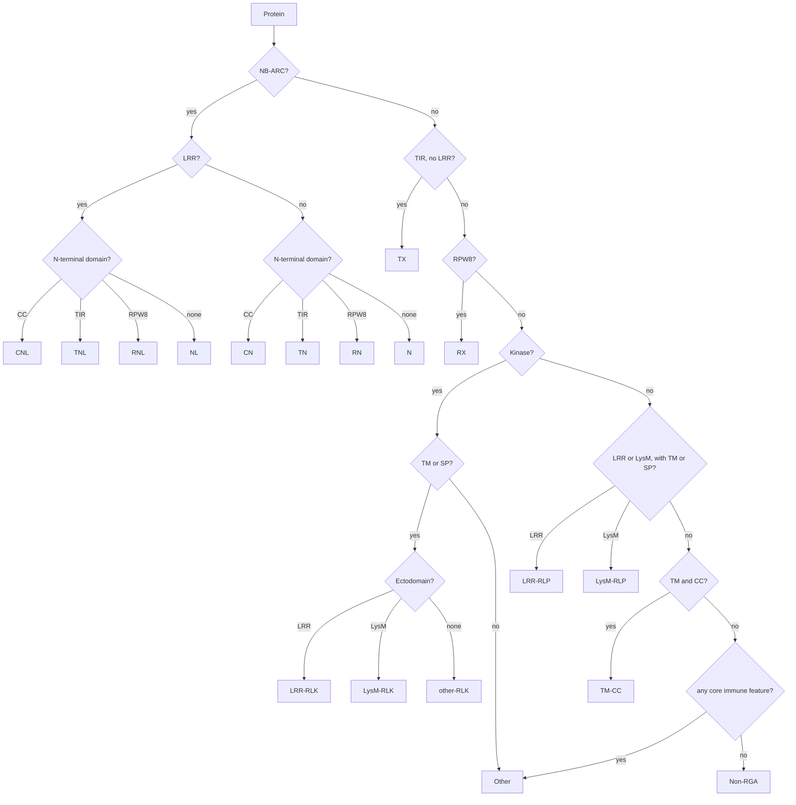

# Genome-wide prediction of Resistance Gene Analogs (RGAs)

A reproducible, organism-agnostic pipeline that turns pre-computed protein-annotation
outputs into a per-protein RGA call with an explicit, human-readable justification.

- Code: [`code/rgas_prediction.py`](../../code/rgas_prediction.py) and the
  [`code/rga/`](../../code/rga) package
- Configuration: [`code/config/rga_config.yaml`](../../code/config/rga_config.yaml)
- Tests: [`code/tests/`](../../code/tests)
- Architecture, design decisions and diagrams:
  [`ARCHITECTURE.md`](ARCHITECTURE.md)
- Second-pass code review: [`REVIEW_NOTES.md`](REVIEW_NOTES.md)
- Reference dataset: the *Saccharum officinarum* × *spontaneum* cv. R570 proteome
  (299,731 proteins over 194,593 loci)

---

## 1. Overview

### What an RGA is

Plant immunity operates in two layers (Jones & Dangl 2006). Cell-surface receptors —
**receptor-like kinases (RLKs)** and **receptor-like proteins (RLPs)** — detect conserved
microbial molecules outside the cell. Intracellular **NLRs** (nucleotide-binding
leucine-rich-repeat receptors) detect pathogen effectors that have entered the cytoplasm.
Both groups have highly characteristic domain architectures, so they can be recognised
from protein sequence alone.

A **Resistance Gene Analog** is a protein that carries the domain architecture of a
resistance protein. It is a *candidate*, identified from sequence features — not an
experimentally validated resistance gene.

### What this pipeline does

1. Reads the outputs of six annotation tools (InterProScan, Phobius, DeepTMHMM,
   SignalP 6.0, DeepLoc 2.0, DeepCoil2).
2. Harmonises them into one controlled vocabulary of nine features: `NB-ARC`, `TIR`,
   `RPW8`, `CC`, `LRR`, `STTK` (Ser/Thr & Tyr kinase), `LysM`, `TM`, `SP`.
3. Applies an ordered list of **mutually exclusive** classification rules and assigns the
   first class that fits.
4. Writes machine-readable tables, a report a biologist can read without any
   bioinformatics background, and a full reproducibility record.

### What this pipeline does *not* do

- It does not run the annotation tools. They must be run beforehand (§3).
- It does not align, cluster or phylogenetically place anything. There is no
  NB-ARC phylogeny, no orthology assignment and no synteny analysis.
- It does not decide whether a candidate is a functional resistance gene. That requires
  experimental validation.
- It does not de-duplicate isoforms in the main table. Every input protein gets exactly
  one row; a locus-level collapse is provided separately (§6).
- It does not detect features the input tools did not report. Missing HMM coverage,
  fragmented gene models and truncated proteins propagate directly into the results (§8).

---

## 2. Installation and dependencies

The project uses [`uv`](https://docs.astral.sh/uv/) for both the Python version and the
dependencies. From the repository root:

```bash
uv sync --extra dev      # creates .venv and installs everything
uv run pytest            # 146 tests, ~1 s
```

`pyproject.toml` pins:

| Requirement | Version used for the reference run |
|---|---|
| Python | 3.14.0 |
| pandas | 3.0.5 |
| numpy | 2.5.2 |
| PyYAML | 6.0.3 |
| pytest (dev only) | 9.1.1 |

There are no other runtime dependencies: no plotting library, no templating engine, no
network access. The HTML report draws its charts with hand-written inline SVG so that it
stays a single self-contained file.

The exact versions of the run that produced a given result directory are recorded in
`run_metadata.json` under `environment`.

---

## 3. Input specification

All six inputs are **read-only**; the pipeline never writes into the input directory.

Files are located under `--input-dir` using the glob patterns in the
`input_discovery` section of the configuration, and any of them can be overridden with an
explicit `--<tool>` path.

### 3.1 InterProScan 5 — **required**

```bash
# Suggested canonical command; the exact command used for R570 was not recorded.
interproscan.sh -i proteome.fasta -f tsv -o r570_interpro.tsv \
                -appl Pfam,SMART,ProSiteProfiles,ProSitePatterns,PRINTS,CDD,Gene3D,SUPERFAMILY,PANTHER,Coils,NCBIfam \
                -goterms -pa -dp
```

Format: tab-separated, **no header**, 15 columns, 1-based inclusive coordinates in
columns 7 and 8.

```text
SoffiXsponR570.7_10Ag383000.3.p	c1e88cf6…	526	PANTHER	PTHR48041	ABC TRANSPORTER G FAMILY MEMBER 28	3	470	1.2E-121	T	09-08-2026	IPR050352	ATP-binding cassette subfamily G transporters	-	-
SoffiXsponR570.7_10Ag383000.3.p	c1e88cf6…	526	Pfam	PF00005	ABC transporter	2	53	3.0E-5	T	09-08-2026	IPR003439	ABC transporter-like, ATP-binding domain	-	-
SoffiXsponR570.7_10Ag383000.3.p	c1e88cf6…	526	Gene3D	G3DSA:3.40.50.300	-	1	118	2.8E-28	T	09-08-2026	IPR027417	P-loop containing nucleoside triphosphate hydrolase	-	-
```

> **InterProScan release.** The TSV records only the run date (`09-08-2026` for R570), not
> the InterProScan or InterPro release number. The release used for the reference run is
> therefore **`TODO`: not recoverable from the data**. Record it manually if you need to
> cite it.

### 3.2 Phobius — optional

```bash
phobius.pl -short proteome.fasta > r570.phobius
```

Format: whitespace-aligned short format (the header typo `SEQENCE ID` is Phobius's own).
The topology string encodes the signal peptide as `n<start>-<end>c<x>/<y>` and each
transmembrane helix as `<start>-<end>` between `i`/`o` markers.

```text
SEQENCE ID                     TM SP PREDICTION
SoffiXsponR570.7os1g052000.1.p  1  0 o50-70i
SoffiXsponR570.7os1g055400.1.p  1  Y n4-15c20/21o396-419i
```

### 3.3 DeepTMHMM — optional

```bash
biolib run DTU/DeepTMHMM --fasta proteome.fasta     # writes TMRs.gff3
```

Format: GFF3-like blocks separated by `//`, 4 significant columns, 1-based inclusive.
Region types observed in R570: `TMhelix`, `signal`, `inside`, `outside`, `Beta sheet`,
`periplasm`.

```text
# SoffiXsponR570.7os1g055400.1.p Length: 780
# SoffiXsponR570.7os1g055400.1.p Number of predicted TMRs: 1
SoffiXsponR570.7os1g055400.1.p	TMhelix	396	416
```

### 3.4 SignalP 6.0 — optional

```bash
signalp6 --fastafile proteome.fasta --organism eukarya --format txt \
         --output_dir signalp6/ --mode fast
```

Format: two `#` comment lines, then 9 tab-separated columns. **Column 1 is the entire
FASTA header**, not the protein ID; the pipeline keeps the first whitespace-delimited
token.

```text
# ID	Prediction	OTHER	SP(Sec/SPI)	LIPO(Sec/SPII)	TAT(Tat/SPI)	TATLIPO(Tat/SPII)	PILIN(Sec/SPIII)	CS Position
SoffiXsponR570.7os1g018900.1.p pacid=55934876 transcript=… org=…	SP	0.000177	0.999286	0.000145	0.000154	0.000123	0.000129	CS pos: 30-31. Pr: 0.9323
SoffiXsponR570.7os1g046800.1.p pacid=55934877 transcript=… org=…	OTHER	1.000000	0.000000	0.000000	0.000000	0.000000	0.000000	
```

### 3.5 DeepLoc 2.0 — optional

```bash
deeploc2 --fasta proteome.fasta --output deeploc2/ --model Accurate
```

Format: CSV with a header. `Localizations` is **multi-label and pipe-separated**; the
per-class probability columns give the score of each label.

```text
Protein_ID,Localizations,Signals,Membrane types,Cytoplasm,Nucleus,Extracellular,Cell membrane,…
SoffiXsponR570.7os1g018900.1.p,Extracellular,Signal peptide,Soluble,0.1109,0.1091,0.8084,0.1371,…
SoffiXsponR570.7os1g046800.1.p,Nucleus,Nuclear localization signal,Soluble,0.1249,0.8997,0.0329,0.0809,…
```

### 3.6 DeepCoil2 — optional but strongly recommended

```bash
deepcoil -i proteome.fasta -out_path deepcoil/ --n_cpu 8    # one .out file per protein
```

Format: one file per protein, named after a **sanitised** protein ID (for R570, the dots
are stripped: `SoffiXsponR570.01Bg000200.1.p` → `SoffiXsponR57001Bg0002001p.out`).
Each file has one row per residue.

```text
aa	cc	raw_cc	prob_a	prob_d
E	0.428	0.154	0.000	0.000
L	0.428	0.261	0.000	0.000
```

The pipeline reads `.out` files from a directory **or streams them straight out of
`.tar.xz` archives**, so a proteome split into 60 compressed parts (as R570 is) needs no
extraction. The parsed raw segments are cached in `<outdir>/cache/`; delete the cache or
pass `--refresh-deepcoil-cache` to re-read.

> **`cc` is not a per-residue probability.** DeepCoil2 has already performed peak
> detection: inside a candidate segment every residue carries the same plateau value and
> outside it the value is exactly `0`. `raw_cc` is the per-residue signal. Segment calling
> must therefore split on a *change of value*, not only on zeros — see §4.4.

### 3.7 Protein identifiers

Tools mangle identifiers differently. Normalisation is configured per tool in the `ids`
section and applied before anything is compared:

| Tool | Identifier as emitted | Normalisation |
|---|---|---|
| InterProScan | `PROT.1.p` | `strip_after_whitespace` |
| Phobius | `PROT.1.p` | `strip_after_whitespace` |
| DeepTMHMM | `PROT.1.p` | `strip_after_whitespace` |
| SignalP 6.0 | `PROT.1.p pacid=… org=…` | `strip_after_whitespace` |
| DeepLoc 2.0 | `PROT.1.p` | `strip_after_whitespace` |
| DeepCoil2 | `PROT1p.out` | reverse lookup via `strip_dots` |

Because the DeepCoil transformation is lossy, it cannot be inverted directly. Instead the
same transformation is applied to every canonical ID to build a lookup table, and the
pipeline **asserts that this mapping is injective** over the proteome before using it. For
R570 there are zero collisions across 299,731 proteins and all 299,731 DeepCoil files map
back to a canonical protein.

No protein is ever silently dropped. Every unmatched identifier, in either direction, is
written to `unmatched_ids_report.tsv` with a reason.

---

## 4. Methodology

### 4.1 Domain evidence — accession matching, never description matching

Feature assignment uses **accessions only**: the signature accession (InterProScan column
5) and the integrated InterPro accession (column 12). Description-string matching is
rejected because it is version-dependent and produces false positives — a regular
expression for `coil` matches `Coiled coil-helix-coiled coil-helix (CHCH) domain profile`
and `LRR_CC_2` (a *cysteine*-containing LRR), neither of which is a coiled coil.

`MobiDBLite` and `AntiFam` are excluded from evidence entirely.

The complete accession → feature mapping is printed in
[§4.10](#410-complete-accession--feature-mapping).

### 4.2 Interval merging and LRR copy number

Redundant databases report the same region repeatedly. All intervals of a given
protein × feature are merged (overlap ≥ `intervals.merge_min_overlap`, default 1 residue)
before anything is counted, so an LRR detected by Pfam, SMART and Gene3D counts once.
All coordinates are 1-based inclusive, in every tool, which is verified in §3.

Two LRR counts are reported:

- **`n_lrr`** — merged intervals from *every* LRR source. This is the count that
  `--min-lrr-copies` gates. Region-level signatures (`G3DSA:3.80.10.10`, SUPERFAMILY)
  span the entire LRR region, so a protein with a dozen repeats normally collapses to a
  single interval. Raising `--min-lrr-copies` above 1 is therefore a blunt filter.
- **`n_lrr_repeats`** — merged intervals from repeat-level signatures only
  (`intervals.lrr_repeat_analyses`, default Pfam/SMART/PRINTS/ProSitePatterns). This is
  the biologically meaningful copy number.

### 4.3 Transmembrane helices, and the signal-peptide artefact

Helices are read from **both** Phobius and DeepTMHMM. The consensus policy is
`--tm-policy {union, intersection, deeptmhmm, phobius}`, default **`union`**, matching
common practice; the policy actually used is logged and written to `run_metadata.json`.

**Signal peptides are routinely mis-called as transmembrane helices** — both are
hydrophobic α-helices. Any predicted helix covered by the signal-peptide region
(residues 1…`sp_end`) by at least `transmembrane.sp_overlap_fraction` of its own length
(default 0.5) is discarded. `sp_end` is the most conservative estimate available: the
maximum over SignalP's cleavage site, Phobius's `c` position and DeepTMHMM's own `signal`
region.

Both the raw and the filtered helix counts are reported (`n_tm_phobius_raw` versus
`n_tm_phobius`), together with `n_tm_dropped_in_sp`, so the effect of the filter is always
visible.

### 4.4 Coiled coils — DeepCoil2 primary, InterProScan Coils secondary

**Why DeepCoil2 is the primary channel.** The legacy rule set (Rody et al. 2019) takes CC
from InterProScan's Coils/ncoils module, a 1991 profile method (Lupas et al. 1991).
Kourelis et al. (2021), benchmarking NLRtracker against RefPlantNLR, report CC as the
domain most frequently missed by InterProScan. DeepCoil2 is a convolutional model
reported by its authors to outperform COILS/PCOILS and Marcoil
(Ludwiczak et al. 2019). Using it as the primary channel is a deliberate departure from
the legacy rule set, and the pipeline is built so that the departure is auditable rather
than assumed: both channels are always recorded, and the report quantifies their
disagreement and its downstream effect.

**Segment calling.** All parameters live under `coiled_coil` in the configuration:

1. Discard raw segments whose plateau score is below `threshold` (default `0.5`).
2. Merge surviving segments separated by at most `max_gap` residues (default `2`).
3. Discard merged segments shorter than `min_length` (default `21` residues ≈ 3 heptads).

Gap merging deliberately happens **before** the length filter, so a genuine coiled coil
interrupted by one or two sub-threshold residues is not lost.

Observed score distribution over R570 part_001 (2,317,452 residues): maximum `0.922`,
`cc > 0` for 6.22 % of residues, `≥ 0.2` for 4.58 %, `≥ 0.5` for 2.43 %, `≥ 0.9` for
0.03 %. Scores are on a 0–1 scale but never reach 1.0.

Recorded per protein: `n_cc_segments`, `cc_max_prob`, `cc_mean_prob_in_segments`
(length-weighted), `cc_coords`, `cc_total_length`.

**Consensus policy.** `--cc-policy {deepcoil, union, intersection, coils}`, default
`deepcoil`. `cc_deepcoil`, `cc_coils`, `cc_consensus` and `cc_source` are all stored.

**N-terminal positional check.** In canonical CNLs the coiled coil lies N-terminal to the
NB-ARC domain. `cc_is_n_terminal` records whether *every* called CC segment ends before
the first NB-ARC residue. This is **informative, never a filter**: a CNL whose only CC
segment sits C-terminal to the NB-ARC keeps its CNL call, gains a warning, and is demoted
one confidence level.

**CC/TM cross-talk.** Hydrophobic helices make coiled-coil and transmembrane predictors
fire on the same region. When a CC segment is covered by a predicted TM helix by more than
`coiled_coil.tm_overlap_fraction` (default 0.5), `cc_tm_ambiguous` is set, both features
are kept, the confidence is demoted and a warning is raised. This matters most for the
`TM-CC` class, which is defined by exactly these two features.

**If DeepCoil2 is absent**, the pipeline falls back to InterProScan Coils, logs a
prominent warning, and marks every CC-dependent call `low` confidence — the legacy
behaviour.

**A third CC channel exists and is not used by default — read this before quoting a CNL
count.** Auditing the R570 InterProScan output turned up `PF18052` / `IPR041118`, the
**Rx N-terminal domain**: the domain-level coiled-coil module of Rx/Gpa2-type plant CNLs,
and the signature RefPlantNLR-style classifiers rely on for the CC of an NLR. It is
carried by **2,611 of the 4,023 R570 NLRs**, but only 325 of those are called `CNL` by the
default configuration.

It is deliberately *not* enabled as CC evidence, because the specification for this
pipeline defines the CC channels as DeepCoil2 (primary) and InterProScan Coils
(secondary), and adding a third, domain-level channel changes the meaning of every
`--cc-policy` setting. Its effect was measured instead, by adding `PF18052` and
`IPR041118` to the `CC` accession list and re-running under `--cc-policy union`:

| Subclass | `--cc-policy deepcoil` (default) | `--cc-policy union` | `union` + Rx N-terminal domain |
|---|---|---|---|
| `CNL` | 396 | 1,790 | **2,648** |
| `NL` | 3,038 | 1,644 | 786 |
| `CN` | 79 | 230 | 358 |
| `N` | 470 | 319 | 191 |
| `TM-CC` | 3,960 | 8,101 | 8,105 |

To enable it, add these two lines under `CC:` in `interproscan_features` and set
`policies.cc` to `union` (or `coils`); note that under `--cc-policy deepcoil` the
InterProScan accession list is not consulted at all, so adding them alone changes nothing.

**Recommendation.** For an NLR-focused analysis, the Rx N-terminal domain is better CC
evidence than either predictor, and the `union` + Rx-domain column is the number closest
to current NLR practice. The default is kept as specified so that the reference run
reproduces the requested rule set exactly.

**The family-level RPW8 signature was correctly rejected.** PANTHER `PTHR36766`
("PLANT BROAD-SPECTRUM MILDEW RESISTANCE PROTEIN RPW8") hits 1,378 proteins, **1,273 of
which carry NB-ARC**. Had it been used as RPW8 evidence, `RNL` would have gone from 7 to
roughly 1,273 — and, because `RNL` outranks `CNL` and `NL`, it would have swallowed most
of the NLR complement. It is recorded in `watch_accessions` and reported in
`accession_audit.tsv`, but never used.

### 4.5 Signal peptides

SignalP 6.0 classes counted as a signal peptide: `SP`, `LIPO`, `TAT`, `TATLIPO`, `PILIN`
(configurable). By default SignalP's own argmax decision is trusted;
`signal_peptide.min_probability` adds an optional probability floor.
`--sp-policy {union, intersection, signalp, phobius}` defaults to **`signalp`**, the more
accurate dedicated predictor. `sp_signalp`, `sp_prob`, `sp_phobius`, `sp_consensus` and
`cleavage_site` are all stored.

### 4.6 DeepLoc 2.0 — supporting evidence only

Localisation **never** decides a class. It is used to:

- populate `predicted_localization`, `localization_prob` and `all_localizations`;
- raise or lower the *confidence* of RLK/RLP/TM-CC calls through membrane support;
- flag inconsistencies (an NLR predicted extracellular, a receptor predicted soluble) in
  the `warnings` column.

### 4.7 Confidence formula

Every protein starts at **`high`** and is demoted one level per triggered rule, floored at
`low`. The rules are declared in `confidence.demotions` and evaluated in order:

| Demotion | Fires when | Levels |
|---|---|---|
| `cc_deepcoil_only` | CC-dependent class; DeepCoil2 called the CC but InterProScan Coils did not | −1 |
| `cc_coils_only` | CC-dependent class; only InterProScan Coils supports the CC | −2 |
| `cc_tm_ambiguous` | CC-dependent class; a CC segment overlaps a predicted TM helix | −2 |
| `cc_not_n_terminal` | CC-dependent class; the CC lies C-terminal to the NB-ARC | −1 |
| `deeploc_inconsistent` | DeepLoc contradicts the class (NLR extracellular / membrane; receptor not membrane-associated) | −1 |
| `missing_channel` | the class depends on a channel whose tool was not supplied | −2 |

CC-dependent classes are `CNL`, `CN`, `TM-CC`. In the language of §2.2 of the
specification: a CC supported by **DeepCoil2 and Coils** is `high`, **DeepCoil2 only** is
`medium`, **Coils only or TM-ambiguous** is `low`. Because CC now has a dedicated deep
learning predictor, CC-dependent calls are no longer categorically low confidence.

`confidence_demotions` lists exactly which rules fired, so the grade is never opaque.

### 4.8 The `reason` field

Every row carries a sentence generated **from the evidence table** — there is no per-class
template, so the text always reflects what the pipeline actually saw:

```text
Rule CNL (priority 1): NB-ARC [PF00931 @ 180-346], CC [deepcoil+coils @ 70-91],
LRR [G3DSA:3.80.10.10 @ 540-811]. Excluded: no TIR, no RPW8.
TM: none (Phobius 0 / DeepTMHMM 0). SP: none (SignalP6 OTHER 1.000).
CC: present (DeepCoil2 1 segment(s), max score 0.670; Coils yes) at 70-91.
CC is N-terminal to NB-ARC. DeepLoc: Nucleus (0.59) -- consistent. Confidence: high.
```

### 4.9 Integrated domains

For NLRs only, any domain from `integrated_domain_analyses` (Pfam by default) that does
not belong to `integrated_domain_canonical_features` and is not in
`integrated_domain_exclusions` is reported as an **integrated domain** — the fusion of a
non-canonical domain to an NLR, central to the integrated-decoy model of effector
recognition.

The exclusion list matters more than it sounds. Without it the *structural* sub-domains of
an ordinary NLR are flagged as integrations: the winged-helix domain of the NB-ARC module
(`PF23559`, on 3,407 R570 NLRs), the Rx-type N-terminal coiled coil (`PF18052`, 2,611) and
the family-specific LRR models (`PF25019`, 1,032). With them excluded, R570 gives:

| Integrated domain | Pfam | NLRs |
|---|---|---|
| Protein kinase | `PF00069` + `PF07714` | 134 |
| EDR4 zinc-ribbon / EDR4-like N-terminal | `PF11331` + `PF22910` | 60 |
| WRKY DNA-binding | `PF03106` | 18 |
| Jacalin-like lectin | `PF01419` | 17 |
| WD40 / G-beta repeat | `PF00400` | 17 |
| BED zinc finger | `PF02892` | 15 |

**285 of the 4,023 NLRs (7.1 %)** carry at least one integrated domain. The composition is
what the literature leads one to expect for a grass — kinase, WRKY and BED fusions
dominate — which is a useful independent check that the exclusion list is drawn in the
right place.

### 4.10 Complete accession → feature mapping

Hit counts are from the R570 reference run (InterProScan, 3,180,078 rows,
run date 09-08-2026). `0` marks an accession that is seeded in the config but
was not observed in this proteome; it is kept so the configuration stays portable.

| Feature | Database | Accession | Hits in R570 |
|---|---|---|---|
| `NB-ARC` | Pfam | `PF00931` | 4,369 |
| `NB-ARC` | InterPro | `IPR002182` | 4,369 |
| `NB-ARC` | Pfam | `PF05729` | 0 |
| `TIR` | Pfam | `PF01582` | 15 |
| `TIR` | Pfam | `PF13676` | 16 |
| `TIR` | SMART | `SM00255` | 15 |
| `TIR` | InterPro | `IPR000157` | 99 |
| `TIR` | PROSITE | `PS50104` | 53 |
| `TIR` | SUPERFAMILY | `SSF52200` | 51 |
| `TIR` | InterPro | `IPR035897` | 104 |
| `RPW8` | Pfam | `PF05659` | 0 |
| `RPW8` | PROSITE | `PS51153` | 7 |
| `RPW8` | InterPro | `IPR008808` | 7 |
| `LRR` | Pfam | `PF00560` | 14,738 |
| `LRR` | Pfam | `PF07723` | 0 |
| `LRR` | Pfam | `PF07725` | 0 |
| `LRR` | Pfam | `PF12799` | 303 |
| `LRR` | Pfam | `PF13306` | 31 |
| `LRR` | Pfam | `PF13516` | 644 |
| `LRR` | Pfam | `PF13855` | 4,400 |
| `LRR` | Pfam | `PF14580` | 23 |
| `LRR` | SMART | `SM00365` | 1,868 |
| `LRR` | SMART | `SM00369` | 18,431 |
| `LRR` | SMART | `SM00370` | 0 |
| `LRR` | InterPro | `IPR001611` | 22,104 |
| `LRR` | InterPro | `IPR003591` | 18,431 |
| `LRR` | InterPro | `IPR032675` | 21,512 |
| `LRR` | Pfam | `PF23598` | 4,482 |
| `LRR` | InterPro | `IPR055414` | 4,482 |
| `LRR` | SMART | `SM00367` | 4,175 |
| `LRR` | InterPro | `IPR006553` | 4,175 |
| `LRR` | Pfam | `PF08263` | 2,596 |
| `LRR` | InterPro | `IPR013210` | 2,596 |
| `LRR` | PROSITE | `PS51450` | 2,322 |
| `LRR` | PRINTS | `PR00019` | 2,956 |
| `LRR` | Pfam | `PF23247` | 336 |
| `LRR` | InterPro | `IPR057135` | 336 |
| `LRR` | Gene3D | `G3DSA:3.80.10.10` | 21,512 |
| `STTK` | Pfam | `PF00069` | 9,304 |
| `STTK` | Pfam | `PF07714` | 6,744 |
| `STTK` | SMART | `SM00220` | 12,583 |
| `STTK` | SMART | `SM00219` | 238 |
| `STTK` | PROSITE | `PS50011` | 15,857 |
| `STTK` | InterPro | `IPR000719` | 37,744 |
| `STTK` | InterPro | `IPR001245` | 9,627 |
| `STTK` | InterPro | `IPR011009` | 16,725 |
| `LysM` | Pfam | `PF01476` | 159 |
| `LysM` | SMART | `SM00257` | 178 |
| `LysM` | InterPro | `IPR018392` | 657 |
| `LysM` | CDD | `cd00118` | 141 |
| `LysM` | SUPERFAMILY | `SSF54106` | 119 |
| `LysM` | InterPro | `IPR036779` | 308 |
| `LysM` | Gene3D | `G3DSA:3.10.350.10` | 189 |
| `CC` | InterProScan Coils | `Coil` | 72,088 |

Accessions recorded but deliberately **not** used as evidence (`watch_accessions`):

| Accession | Hits in R570 | Why it is excluded |
|---|---|---|
| `PTHR36766` | 1,378 | PANTHER: PLANT BROAD-SPECTRUM MILDEW RESISTANCE PROTEIN RPW8 (family-level, not used as RPW8 evidence) |
| `PTHR33463` | 412 | PANTHER: NB-ARC DOMAIN-CONTAINING PROTEIN-RELATED (family-level, not used as NB-ARC evidence) |

---

## 5. Classification rules

### 5.1 Decision flow



### 5.2 The rule table

Rules are evaluated in priority order and the first match wins. Priorities 1–17 are
written so that they are mutually exclusive **independently of their order**; priorities
18–19 are ordered catch-alls.

| # | Rule | Family | Requires | Requires one of | Forbids |
|---|---|---|---|---|---|
| 1 | `CNL` | NLR | NB-ARC, CC, LRR | — | TIR, RPW8 |
| 2 | `TNL` | NLR | NB-ARC, TIR, LRR | — | RPW8 |
| 3 | `RNL` | NLR | NB-ARC, RPW8, LRR | — | — |
| 4 | `NL` | NLR | NB-ARC, LRR | — | CC, TIR, RPW8 |
| 5 | `CN` | NLR | NB-ARC, CC | — | LRR, TIR, RPW8 |
| 6 | `TN` | NLR | NB-ARC, TIR | — | LRR, RPW8 |
| 7 | `RN` | NLR | NB-ARC, RPW8 | — | LRR |
| 8 | `N` | NLR | NB-ARC | — | CC, TIR, RPW8, LRR |
| 9 | `TX` | NLR-associated | TIR | — | NB-ARC, LRR |
| 10 | `RX` | NLR-associated | RPW8 | — | NB-ARC, TIR |
| 11 | `LRR-RLK` | RLK | STTK, LRR | TM or SP | NB-ARC, TIR, RPW8 |
| 12 | `LysM-RLK` | RLK | STTK, LysM | TM or SP | NB-ARC, TIR, RPW8, LRR |
| 13 | `other-RLK` | RLK | STTK | TM or SP | NB-ARC, TIR, RPW8, LRR, LysM |
| 14 | `LRR-RLP` | RLP | LRR | TM or SP | NB-ARC, TIR, RPW8, STTK |
| 15 | `LysM-RLP` | RLP | LysM | TM or SP | NB-ARC, TIR, RPW8, STTK, LRR |
| 16 | `other-RLP` | RLP | — | (TM or SP) and (ectodomain) | NB-ARC, TIR, RPW8, STTK, LRR, LysM |
| 17 | `TM-CC` | TM-CC | TM, CC | — | NB-ARC, STTK, LRR, LysM, TIR, RPW8 |
| 18 | `Other` | Other | at least one core immune feature | — | — |
| 19 | `Non-RGA` | Non-RGA | no core immune feature | — | — |

Notes on the design:

- **Mutual exclusivity is proved, not asserted in a comment.**
  `rules.find_overlapping_rules()` enumerates all 2⁹ = 512 subsets of the feature
  vocabulary and checks that no two non-fallback rules fire on the same one. The pipeline
  runs this check at startup and `test_rules.py` runs it in CI. A second test checks that
  ordered evaluation assigns exactly one class to every one of the 512 combinations.
- **`other-RLP` is deliberately unreachable** with the default `ectodomain_features`
  (`[LRR, LysM]`), because both already have their own rule. It exists so that a config
  which adds a third ectodomain feature gets an RLP subclass for free, and it is reported
  with a count of 0. A test asserts this.
- **TIR outranks kinase.** A TIR protein with a kinase domain and no NB-ARC or LRR is
  `TX`, not an RLK. This follows the priority order of the specification; it is stated
  here because it is a real biological decision (IRAK-like TIR-kinases exist).
- **A lone coiled coil is not immune evidence.** `core_immune_features` deliberately
  excludes `CC`, which departs from Rody et al. (2019). Under the legacy definition every
  protein with a predicted coiled coil — 42,300 proteins in R570 by InterProScan Coils
  alone — would be reported as an `Other` RGA. To reproduce the legacy behaviour exactly,
  add `CC` to `core_immune_features` in the configuration; nothing else changes.

### 5.3 One worked example per class

Every example below is a real R570 protein; the `reason` column of
`rga_predictions.tsv` carries the full trace.

| Class | n in R570 | Example protein | Architecture | Confidence |
|---|---|---|---|---|
| `CNL` | 396 | `SoffiXsponR570.01Ag387200.1.p` | `CC-NB-ARC-LRR` | high |
| `TNL` | 0 | — | — | — |
| `RNL` | 7 | `SoffiXsponR570.09Ag135100.1.p` | `RPW8-NB-ARC-LRR` | high |
| `NL` | 3,038 | `SoffiXsponR570.01Ag021800.1.p` | `NB-ARC-LRR` | high |
| `CN` | 79 | `SoffiXsponR570.01Eg226800.1.p` | `CC-NB-ARC` | high |
| `TN` | 33 | `SoffiXsponR570.03Ag132500.1.p` | `TIR-NB-ARC` | high |
| `RN` | 0 | — | — | — |
| `N` | 470 | `SoffiXsponR570.01Ag185600.1.p` | `NB-ARC` | high |
| `TX` | 20 | `SoffiXsponR570.05Ag076500.1.p` | `TIR` | high |
| `RX` | 0 | — | — | — |
| `LRR-RLK` | 2,992 | `SoffiXsponR570.01Ag036700.1.p` | `LRR-TM-STTK` | high |
| `LysM-RLK` | 45 | `SoffiXsponR570.01Ag452300.1.p` | `SP-LysM-TM-STTK` | high |
| `other-RLK` | 5,527 | `SoffiXsponR570.01Ag020500.1.p` | `SP-TM-STTK` | high |
| `LRR-RLP` | 1,238 | `SoffiXsponR570.01Ag021100.1.p` | `SP-LRR` | high |
| `LysM-RLP` | 80 | `SoffiXsponR570.01Ag521200.1.p` | `SP-LysM-TM` | high |
| `other-RLP` | 0 | — | — | — |
| `TM-CC` | 3,960 | `SoffiXsponR570.01Ag051400.1.p` | `CC-TM` | high |
| `Other` | 11,266 | `SoffiXsponR570.01Ag001100.1.p` | `STTK` | high |
| `NA` | 270,580 | `SoffiXsponR570.01Ag000100.1.p` | `NA` | high |

Full traces for one representative of each of the five families:

**`CNL` — `SoffiXsponR570.01Ag387200.1.p`**

```text
Rule CNL (priority 1): NB-ARC [PF00931 @ 180-346], CC [deepcoil+coils @ 70-91], LRR [G3DSA:3.80.10.10 @ 540-811]. Excluded: no TIR, no RPW8. TM: none (Phobius 0 / DeepTMHMM 0). SP: none (SignalP6 OTHER 1.000). CC: present (DeepCoil2 1 segment(s), max score 0.670; Coils yes) at 70-91. CC is N-terminal to NB-ARC. DeepLoc: Nucleus (0.59) -- consistent. Confidence: high.
```

**`LRR-RLK` — `SoffiXsponR570.01Ag036700.1.p`**

```text
Rule LRR-RLK (priority 11): STTK [PF07714 @ 223-494, PS50011 @ 220-499, SM00220 @ 220-494, SSF56112 @ 202-495], LRR [G3DSA:3.80.10.10 @ 3-141, PF00560 @ 26-47, PF00560 @ 49-71, PF00560 @ 73-94], TM [154-176]. Excluded: no NB-ARC, no TIR, no RPW8. TM: present (Phobius 1 / DeepTMHMM 1). SP: none (SignalP6 OTHER 1.000). CC: none (DeepCoil2 0 segment(s); Coils no). DeepLoc: Cell membrane (0.91) -- consistent. Confidence: high.
```

**`LRR-RLP` — `SoffiXsponR570.01Ag021100.1.p`**

```text
Rule LRR-RLP (priority 14): LRR [G3DSA:3.80.10.10 @ 240-328, G3DSA:3.80.10.10 @ 329-509, G3DSA:3.80.10.10 @ 35-239, PF00560 @ 317-338, +4 more], SP [cleavage site 34-35]. Excluded: no NB-ARC, no TIR, no RPW8, no STTK. TM: none (Phobius 0 / DeepTMHMM 0). SP: present (SignalP6 SP 0.999, CS 34-35). CC: none (DeepCoil2 0 segment(s); Coils no). DeepLoc: Extracellular (0.60) -- consistent. Confidence: high.
```

**`TM-CC` — `SoffiXsponR570.01Ag051400.1.p`**

```text
Rule TM-CC (priority 17): TM [194-213], CC [deepcoil+coils @ 130-179]. Excluded: no NB-ARC, no STTK, no LRR, no LysM, no TIR, no RPW8. TM: present (Phobius 1 / DeepTMHMM 1). SP: none (SignalP6 OTHER 1.000). CC: present (DeepCoil2 1 segment(s), max score 0.705; Coils yes) at 130-179. DeepLoc: Cell membrane (0.61) -- consistent. Confidence: high.
```

**`Other` — `SoffiXsponR570.01Ag001100.1.p`**

```text
Rule Other (priority 18): STTK [PF07714 @ 898-1158, PR00109 @ 1015-1033, PR00109 @ 1086-1108, PR00109 @ 1130-1152, +4 more]. TM: none (Phobius 0 / DeepTMHMM 0). SP: none (SignalP6 OTHER 1.000). CC: none (DeepCoil2 0 segment(s); Coils no). DeepLoc: Cytoplasm (0.57) -- consistent. Confidence: high.
```

Classes with zero members in R570: `TNL`, `RN`, `RX`, `other-RLP`.
`TNL` and `RN`/`RX` are biologically expected to be rare or absent in a grass;
`other-RLP` is unreachable by design (§5.2).

---

## 6. Outputs

Written under `--outdir` (default `results/rgas/<organism>/`). Every file is UTF-8,
tab-separated, has a header, and uses the literal string `NA` for missing values — never
an empty cell, never `NaN`.

| File | Contents |
|---|---|
| `rga_predictions.tsv` | one row per input protein (or per RGA with `--rga-only`) |
| `rga_predictions_rga_only.tsv` | the same table filtered to `is_rga == True` |
| `rga_predictions_by_locus.tsv` | isoforms collapsed onto their locus |
| `rga_domain_evidence_long.tsv` | one row per protein × feature × supporting hit |
| `rga_summary_counts.tsv` | counts and percentages per family and per subclass |
| `unmatched_ids_report.tsv` | every identifier present in one tool but not another, with a reason |
| `accession_audit.tsv` | which configured accessions were observed, and how often |
| `cc_segment_sensitivity.tsv` | CC-positive proteins across the threshold × min-length grid |
| `cc_policy_sensitivity.tsv` | subclass counts under each of the four `--cc-policy` settings |
| `report.html` | self-contained human-readable report (inline CSS and SVG, no CDN, no JS) |
| `report.md` | the same content in Markdown |
| `run_metadata.json` | timestamp, versions, resolved config, CLI args, input checksums, counts |
| `logs/run.log` | full structured log of the run |
| `cache/deepcoil_raw_segments.tsv` | unfiltered DeepCoil2 segments, reused across runs |

### 6.1 Data dictionary — `rga_predictions.tsv`

| Column | Type | Meaning |
|---|---|---|
| `protein_id` | str | canonical protein identifier |
| `locus` | str | locus identifier extracted with `ids.locus_regex` |
| `sequence_length` | int | protein length as reported by InterProScan |
| `is_rga` | bool | `True` for every family except `Non-RGA` |
| `rga_family` | str | `NLR`, `NLR-associated`, `RLK`, `RLP`, `TM-CC`, `Other`, `Non-RGA` |
| `rga_subclass` | str | the subclass assigned by the matched rule |
| `domain_architecture` | str | features ordered N→C by coordinate, e.g. `CC-NB-ARC-LRR` |
| `features_found` | str | `;`-separated, sorted controlled-vocabulary features |
| `n_lrr` | int | merged LRR intervals from every source |
| `n_lrr_repeats` | int | merged LRR intervals from repeat-level signatures only |
| `defining_domain_databases` | int | distinct signature databases supporting the class-defining domain |
| `n_tm_phobius` | int | Phobius helices **after** the signal-peptide filter |
| `n_tm_deeptmhmm` | int | DeepTMHMM helices after the signal-peptide filter |
| `n_tm_phobius_raw` | int | helices as reported by Phobius |
| `n_tm_deeptmhmm_raw` | int | helices as reported by DeepTMHMM |
| `n_tm_dropped_in_sp` | int | helices discarded because they lie inside the signal peptide |
| `tm_consensus` | bool | TM feature after applying `--tm-policy` |
| `sp_signalp` | bool | SignalP 6.0 called a signal peptide |
| `sp_phobius` | bool | Phobius called a signal peptide |
| `sp_consensus` | bool | SP feature after applying `--sp-policy` |
| `signalp_prediction` | str | SignalP class (`SP`, `LIPO`, `TAT`, `TATLIPO`, `PILIN`, `OTHER`) |
| `sp_prob` | float | probability SignalP assigned to the class it predicted |
| `cleavage_site` | str | cleavage position, e.g. `30-31` |
| `cc_deepcoil` | bool | DeepCoil2 called at least one segment after filtering |
| `cc_coils` | bool | InterProScan Coils reported at least one hit |
| `cc_consensus` | bool | CC feature after applying `--cc-policy` |
| `cc_source` | str | `deepcoil+coils`, `deepcoil_only`, `coils_only` or `NA` |
| `n_cc_segments` | int | retained DeepCoil2 segments |
| `cc_max_prob` | float | highest plateau score among retained segments |
| `cc_mean_prob_in_segments` | float | length-weighted mean plateau score |
| `cc_total_length` | int | residues covered by retained segments |
| `cc_coords` | str | retained segments as `start-end,start-end` |
| `cc_is_n_terminal` | bool | every CC segment ends before the first NB-ARC residue |
| `cc_tm_ambiguous` | bool | a CC segment overlaps a predicted TM helix |
| `predicted_localization` | str | DeepLoc primary label |
| `localization_prob` | float | probability of that label |
| `all_localizations` | str | full multi-label DeepLoc call, `|`-separated |
| `has_integrated_domain` | bool | NLR carrying a non-canonical Pfam domain |
| `integrated_domains` | str | `;`-separated accessions of those domains |
| `rule_id` | str | identifier of the rule that fired |
| `rule_priority` | int | its priority |
| `reason` | str | full human-readable justification |
| `confidence` | str | `high`, `medium` or `low` |
| `confidence_demotions` | str | `;`-separated ids of the demotions that fired |
| `warnings` | str | `;`-separated caveats attached to this call |
| `evidence_tools_available` | str | evidence channels present in this run |

### 6.2 `rga_domain_evidence_long.tsv`

`protein_id`, `feature`, `tool`, `analysis`, `accession`, `signature_description`,
`start`, `end`, `score_or_evalue`. One row per supporting hit, including DeepCoil2 CC
segments and consensus TM helices.

### 6.3 `rga_predictions_by_locus.tsv`

`locus`, `n_isoforms`, `n_isoforms_rga`, `representative_protein_id`, `rga_family`,
`rga_subclass`, `subclasses_observed`, `isoforms_disagree`, `confidence`. The
representative is the longest isoform, ties broken by protein ID. `isoforms_disagree`
flags loci whose isoforms did not all receive the same subclass — a direct readout of how
much alternative and fragmented gene models perturb the counts.

For R570: 194,593 loci, of which **16,572 carry at least one RGA isoform** (against 29,151
RGA proteins — a 1.76-fold isoform inflation) and **2,214 are NLR loci** (against 4,023 NLR
proteins). 1,274 loci have isoforms that were assigned different subclasses.

---

## 7. Adapting the pipeline to another organism

Edit `code/config/rga_config.yaml`, and nothing else.

1. **Identifiers** (`ids`). Set `per_tool` normalisations to match how your tools mangle
   IDs, `deepcoil_canonical_form` to the sanitisation DeepCoil applied (or `null` if the
   file names already match), and `locus_regex` so group 1 captures your locus.
   The pipeline aborts if the DeepCoil transformation is not injective for your proteome.
2. **Input layout** (`input_discovery`). Adjust the glob patterns, or pass explicit
   `--interproscan`, `--phobius`, … paths and ignore this section.
3. **Accessions** (`interproscan_features`). Add or remove accessions per feature. Run
   once and read `accession_audit.tsv`: it lists every configured accession with its hit
   count and marks the unused ones. `watch_accessions` lets you monitor a family-level
   signature without letting it become evidence.
4. **Thresholds**. `coiled_coil.threshold` / `min_length` / `max_gap`,
   `transmembrane.sp_overlap_fraction`, `intervals.min_lrr_copies`.
5. **Policies** (`policies`). TM, SP and CC consensus, all overridable per run on the
   command line.
6. **Rules** (`rules`). Add a family, a subclass or an ectodomain. If you add a rule, the
   mutual-exclusivity check will tell you immediately whether it overlaps an existing one;
   add the necessary `none_of` entries until it passes.
7. **Legacy behaviour.** Add `CC` to `core_immune_features` to reproduce the Rody et al.
   (2019) definition of an `Other` RGA.

No accession, threshold or rule is hard-coded in the Python source; `test_config.py`
covers the validation that keeps it that way.

---

## 8. Limitations and caveats

**Coiled coils remain the weakest feature, and the CNL count is the least stable number
this pipeline produces.** DeepCoil2 improves sensitivity over profile-based methods, but
every CC call is threshold-dependent, non-canonical coiled coils are still under-detected,
and CC/TM confusion persists. The magnitude is measured rather than asserted. In R570:

- across the four `--cc-policy` settings, `CNL` ranges from **244** (`intersection`) to
  **1,790** (`union`) — a 7-fold swing;
- adding the Rx N-terminal domain as a third CC channel takes it to **2,648** (§4.4);
- across the threshold × min-length grid, the number of CC-positive proteins ranges from
  13,744 to 63,371 — a 4.6-fold swing.

So the defensible statement about R570 is "between roughly 250 and 2,650 NLRs carry a
detectable N-terminal coiled coil, depending on how a coiled coil is defined", not
"R570 has 396 CNLs". The 396 in the reference run is one point in that range, produced by
one specific and documented parameter set.

**Under these defaults, DeepCoil2 is *stricter* than InterProScan Coils, not more
sensitive.** At `threshold 0.5` / `min_length 21`, DeepCoil2 calls a CC on 18,744 proteins
while InterProScan Coils calls one on 42,300; the 2×2 contingency is 14,165 both /
4,579 DeepCoil2-only / 28,135 Coils-only. At `threshold 0.2` / `min_length 14` DeepCoil2
calls 63,371 — more than Coils. The literature claim that deep-learning predictors
outperform COILS concerns accuracy, not permissiveness, and the direction of the
difference here is entirely a function of the chosen threshold. This is stated because it
runs against the naive reading of §4.4, and the data says what it says.

**Domain-based prediction identifies candidates, not resistance genes.** An RGA call
means "this protein has the architecture of an immune receptor". Function requires
experimental validation.

**Polyploid genomes inflate every count.** R570 is a highly polyploid, aneuploid hybrid:
299,731 proteins over 194,593 loci, so 1.54 proteins per locus on average. Homoeologous
copies, allelic haplotypes and fragmented or partial gene models all produce separate
rows. Use `rga_predictions_by_locus.tsv` and treat protein-level counts as upper bounds.

**HMM-based LRR detection is incomplete.** LRRs are short, degenerate and poorly modelled
by profile HMMs; the true repeat count is routinely underestimated, and region-level
signatures merge everything into one interval (§4.2).

**An RLK/RLP call is topology inference, not evidence of function.** "Kinase plus a
transmembrane helix" says a protein is probably a membrane-anchored kinase — not that it
is an immune receptor. The `other-RLK` class in particular (5,527 proteins in R570) is
dominated by ordinary receptor kinases with no established role in immunity.

**`TM-CC` is the noisiest class and should be treated as a screening bucket.** It is
defined by the two least specific features in the vocabulary, so it collects any
tail-anchored coiled-coil protein. The highest-confidence `TM-CC` call in R570,
`SoffiXsponR570.01Ag051400.1.p`, is a VAMP/synaptobrevin R-SNARE: its "coiled coil"
(residues 159–179) is the v-SNARE coiled-coil homology domain (`PS50892`) and its
"transmembrane helix" (194–213) is the SNARE tail anchor. Nothing in the pipeline is
wrong — the protein genuinely has a TM and a CC — but it is not an immune receptor.
3,960 `TM-CC` proteins in R570 should be read as an upper bound on a heterogeneous class,
and filtered further before use.

**NLR counts depend on proteome completeness and isoform redundancy.** They also depend on
the NB-ARC model: every NLR in this analysis derives from `PF00931`/`IPR002182`, so an
NB-ARC too divergent for that model is invisible here.

**No TNLs were found in R570, and that is expected.** TIR-NLRs are essentially absent from
grasses; finding zero is a sanity check, not a failure. Conversely, `RNL` rests on a very
thin base: `PF05659` is absent from the R570 InterProScan run, so RPW8 is called from the
PROSITE profile `PS51153` alone (7 proteins). The RNL count is a floor, not an estimate.

**Descriptive statistics only.** No statistical test is performed and no expression data
is used; the counts are what they are.

---

## 9. Reproducibility

`run_metadata.json` records, for every run: UTC timestamp, script and configuration
version, the exact command line, all resolved options, the **fully resolved configuration**,
the SHA-256 checksum, byte size and line count of every input file, which evidence
channels were available, the Python and package versions, and every count reported.

To re-run an analysis: check out the same commit, verify the input checksums against
`run_metadata.json`, and run the command recorded in `command`. Output ordering is
deterministic (stable sorts throughout, no reliance on dict or set iteration order), so
two runs on the same inputs produce byte-identical tables.

The DeepCoil2 cache under `cache/` holds *unfiltered* segments, so changing the CC
threshold, minimum length or gap parameter never requires re-reading the archives — and
never changes what the cache contains.

---

## 10. References

All DOIs below were verified against the Crossref API (and, for the bioRxiv preprint,
the bioRxiv API) on 2026-08-24.

**RGA classification frameworks**

1. Rody HVS, Bombardelli RGH, Creste S, Camargo LEA, Van Sluys M-A, Monteiro-Vitorello CB
   (2019). *Genome survey of resistance gene analogs in sugarcane: genomic features and
   differential expression of the innate immune system from a smut-resistant genotype.*
   BMC Genomics 20:809. doi:[10.1186/s12864-019-6207-y](https://doi.org/10.1186/s12864-019-6207-y)
2. Li P, Quan X, Jia G, Xiao J, Cloutier S, You FM (2016). *RGAugury: a pipeline for
   genome-wide prediction of resistance gene analogs (RGAs) in plants.* BMC Genomics
   17:852. doi:[10.1186/s12864-016-3197-x](https://doi.org/10.1186/s12864-016-3197-x)
3. Sekhwal MK, Li P, Lam I, Wang X, Cloutier S, You FM (2015). *Disease resistance gene
   analogs (RGAs) in plants.* Int J Mol Sci 16:19248–19290.
   doi:[10.3390/ijms160819248](https://doi.org/10.3390/ijms160819248)
4. Kourelis J, Sakai T, Adachi H, Kamoun S (2021). *RefPlantNLR is a comprehensive
   collection of experimentally validated plant disease resistance proteins from the NLR
   family.* PLoS Biology 19(10):e3001124.
   doi:[10.1371/journal.pbio.3001124](https://doi.org/10.1371/journal.pbio.3001124)
5. Smith M, Jones JT, Hein I (2025). *Resistify: a novel NLR classifier that reveals
   Helitron-associated NLR expansion in Solanaceae.* Bioinform Biol Insights
   19:11779322241308944.
   doi:[10.1177/11779322241308944](https://doi.org/10.1177/11779322241308944)
6. Shiu S-H, Bleecker AB (2003). *Expansion of the receptor-like kinase/Pelle gene family
   and receptor-like proteins in Arabidopsis.* Plant Physiol 132:530–543.
   doi:[10.1104/pp.103.021964](https://doi.org/10.1104/pp.103.021964)
7. Jones JDG, Dangl JL (2006). *The plant immune system.* Nature 444:323–329.
   doi:[10.1038/nature05286](https://doi.org/10.1038/nature05286)

**Tools**

8. Jones P et al. (2014). *InterProScan 5: genome-scale protein function classification.*
   Bioinformatics 30:1236–1240.
   doi:[10.1093/bioinformatics/btu031](https://doi.org/10.1093/bioinformatics/btu031)
9. Käll L, Krogh A, Sonnhammer ELL (2004). *A combined transmembrane topology and signal
   peptide prediction method.* J Mol Biol 338:1027–1036.
   doi:[10.1016/j.jmb.2004.03.016](https://doi.org/10.1016/j.jmb.2004.03.016)
10. Hallgren J, Tsirigos KD, Pedersen MD, Almagro Armenteros JJ, Marcatili P, Nielsen H,
    Krogh A, Winther O (2022). *DeepTMHMM predicts alpha and beta transmembrane proteins
    using deep neural networks.* bioRxiv 2022.04.08.487609.
    doi:[10.1101/2022.04.08.487609](https://doi.org/10.1101/2022.04.08.487609)
11. Teufel F et al. (2022). *SignalP 6.0 predicts all five types of signal peptides using
    protein language models.* Nat Biotechnol 40:1023–1025.
    doi:[10.1038/s41587-021-01156-3](https://doi.org/10.1038/s41587-021-01156-3)
12. Thumuluri V et al. (2022). *DeepLoc 2.0: multi-label subcellular localization
    prediction using protein language models.* Nucleic Acids Res 50:W228–W234.
    doi:[10.1093/nar/gkac278](https://doi.org/10.1093/nar/gkac278)
13. Ludwiczak J, Winski A, Szczepaniak K, Alva V, Dunin-Horkawicz S (2019). *DeepCoil — a
    fast and accurate prediction of coiled-coil domains in protein sequences.*
    Bioinformatics 35(16):2790–2795.
    doi:[10.1093/bioinformatics/bty1062](https://doi.org/10.1093/bioinformatics/bty1062)
14. Lupas A, Van Dyke M, Stock J (1991). *Predicting coiled coils from protein sequences.*
    Science 252:1162–1164.
    doi:[10.1126/science.252.5009.1162](https://doi.org/10.1126/science.252.5009.1162)

**Signature databases.** Every feature call ultimately rests on an accession issued by one
of these resources, so they are cited as data sources, not merely as tools.

15. Blum M et al. (2025). *InterPro: the protein sequence classification resource in 2025.*
    Nucleic Acids Res 53:D444–D456.
    doi:[10.1093/nar/gkae1082](https://doi.org/10.1093/nar/gkae1082)
16. Paysan-Lafosse T et al. (2025). *The Pfam protein families database: embracing AI/ML.*
    Nucleic Acids Res 53:D523–D534.
    doi:[10.1093/nar/gkae997](https://doi.org/10.1093/nar/gkae997)

**Database releases.** Cite the InterPro/Pfam release used for your InterProScan run. For
the R570 reference run the release number is **not recorded in the data** — the TSV carries
only the run date `09-08-2026` — so it is left as a `TODO` rather than guessed.

**DeepCoil2 model version.** The reference run used pre-computed DeepCoil output whose
model version is not recorded in the `.out` files. Cite Ludwiczak et al. (2019) and state
the DeepCoil2 model version from your own run; it is a `TODO` here for the same reason.

---

## 11. How to cite, and licence

If you use this pipeline, please cite the tools and databases it consumes (references 8–16) and the
classification frameworks it implements (references 1, 2 and 4), and identify the pipeline
as:

> RGA prediction pipeline v1.0.0, `code/rgas_prediction.py`, in
> *SugarcaneTranscriptomics* (this repository). Configuration `rga_config.yaml` v1.0.0.

The licence of this repository applies. If no licence file is present, contact the
repository owner before redistributing.
